# I-JEPA 胸片自监督表征行为诊断报告

> 本报告是思考脚手架，目标不是写论文，而是理清实验逻辑、确认证据强度、找出缺口，为后续提出 JEPA 改进方法做准备。
>
> 原始报告备份：`EXPERIMENT_REPORT_backup_20260507.md`

更新日期：2026-05-07
上游预训练数据：MIMIC-CXR
下游评估数据：VinDr-CXR / VinBigData chest X-ray labeled subset
评估协议：frozen encoder + linear probe，固定 held-out split，train=12,000，validation=3,000

---

## 1. 研究动机

我们有一个 I-JEPA 模型在 MIMIC-CXR 上预训练完，也有 MAE 作为对比 baseline。现在要做的事情不是急着 claim "谁更好"，而是**通过对照实验理解 I-JEPA 在胸片里到底学到了什么**。

具体而言，我们关心两个维度：

- **维度 A — 表征稳定性**：I-JEPA 对不应该改变诊断语义的扰动（噪声、亮度、模糊等）是否稳定？不稳定的话，问题出在 encoder 表征的哪一层？是高频纹理依赖还是决策边界问题？
- **维度 B — 病灶敏感性**：I-JEPA 是否对医生标注的病灶区域有响应？如果有，响应是否真正落在病灶内部？如果没有，那 I-JEPA 到底在看什么来做分类？

两条线的终点是形成对 JEPA 行为的深入理解，而不是打分。

---

## 2. 实验协议

### 2.1 预训练模型

| 模型 | 说明 |
|---|---|
| I-JEPA-H/95 | ViT-H I-JEPA，MIMIC-CXR 预训练 95 epoch |
| I-JEPA-H/201 | ViT-H I-JEPA，MIMIC-CXR 预训练 201 epoch（当前最新完整 checkpoint） |
| MAE-H/97 | ViT-H MAE，ImageNet 初始化后在 MIMIC-CXR 预训练 97 epoch |
| MAE-H/300 | ViT-H MAE，同一配置继续预训练到 300 epoch（2026-05-06 完成，checkpoint-299.pth） |

注：I-JEPA 预训练在 202 epoch 收到 SIGTERM 停止，目前没有 I-JEPA-H/300 checkpoint。

### 2.2 下游数据与评估

- 下游数据：VinDr-CXR / VinBigData chest X-ray labeled subset
- Split：deterministic held-out，train=12,000，validation=3,000
- 评估方式：frozen encoder + linear probe（所有主实验统一）
- 注意：当前是 internal validation，不是官方 test benchmark

### 2.3 主要指标

| 指标 | 含义 | 用在哪里 |
|---|---|---|
| Macro AUROC | 多标签分类主指标 | 所有实验 |
| AUROC drop | 扰动后 AUROC 相对 clean 的下降 | Exp1, Exp3 |
| Cosine drift | clean 与扰动后 embedding 的余弦距离，越小越稳定 | Exp1, Exp3, Exp4 |
| Logit drop | `logit(original) − logit(occluded)`，正值表示遮挡后目标类别分数下降 | Exp2b |
| Delta logit drop | lesion logit drop 减 matched control logit drop | Exp2b |
| Inside saliency ratio / soft IoU | 梯度×激活 saliency 落在 bbox 内的比例 | Exp4 |

Delta 的解释要小心：Delta 为正只说明 lesion 遮挡比 control 遮挡影响更大。如果 lesion drop 和 control drop 都是负数，则不能说模型"依赖病灶"，只能说两种遮挡的相对效应不同。

---

## 3. Line 1 — 鲁棒性诊断

核心问题：I-JEPA 对不应该改变诊断语义的扰动是否稳定？不稳定的话问题出在哪？

### 3.1 Clean 基线

| 模型 | Clean Macro AUROC | F1 |
|---|---|---|
| MAE-H/300 | 0.8909 | 0.2254 |
| MAE-H/97 | 0.8951 | 0.2456 |
| I-JEPA-H/95 | 0.9105 | 0.3484 |
| I-JEPA-H/201 | **0.9162** | **0.3721** |

I-JEPA 两档预训练均高于 MAE。MAE 训练到 300 epoch 的 clean AUROC（0.8909）反而略微低于 97 epoch（0.8951），没有追上 I-JEPA。

### 3.2 Exp1：常规扰动鲁棒性（发现问题）

**实验设计**：对 held-out 图像施加 Gaussian noise、Gaussian blur、brightness shift、contrast scaling 四类扰动，每类 4 个强度，评估分类性能和 embedding drift。

**扰动可视化**：

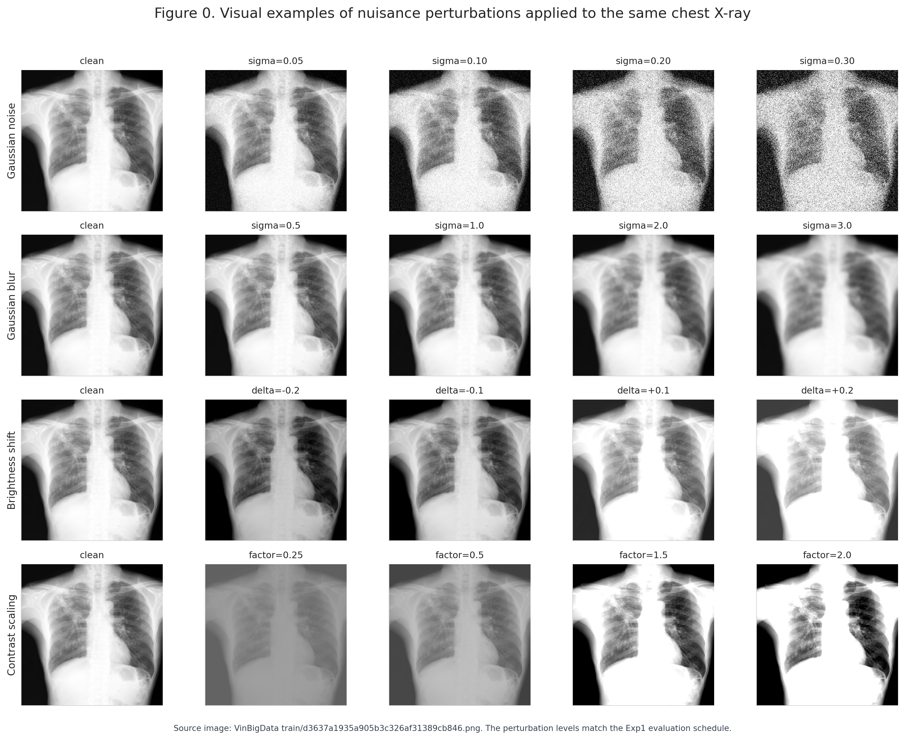

**完整鲁棒性表格**（每格：AUROC，括号内为相对 clean 的 AUROC drop 和 cosine drift d）：

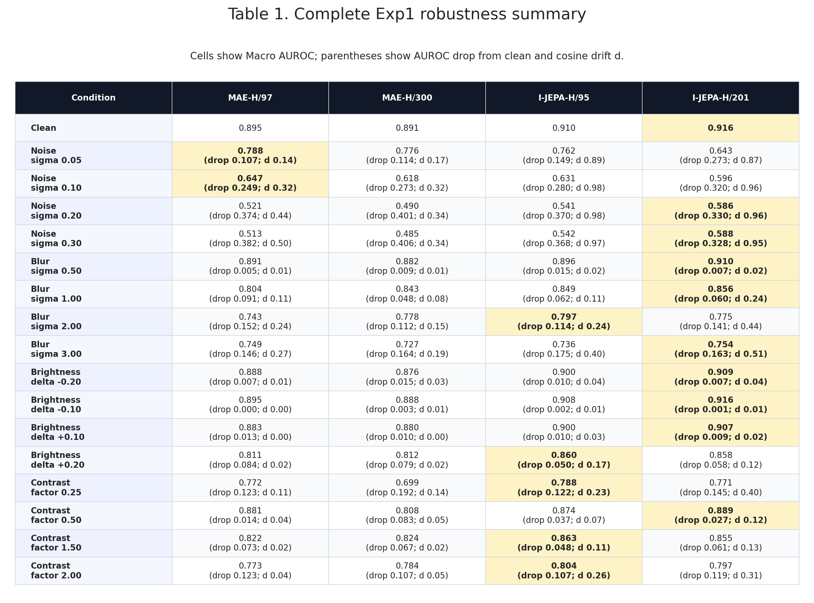

**四种扰动下的关键对比数据**：

**Gaussian Noise**：

| 模型 | Clean | σ=0.05 | σ=0.10 | σ=0.20 | σ=0.30 |
|---|---|---|---|---|---|
| I-JEPA-H/95 | .9105 | .7616 (d 0.889) | .6306 (d 0.975) | .5408 (d 0.977) | .5422 (d 0.974) |
| I-JEPA-H/201 | .9162 | .6431 (d 0.872) | .5960 (d 0.963) | .5861 (d 0.960) | .5882 (d 0.953) |
| MAE-H/97 | .8951 | .7880 (d 0.142) | .6466 (d 0.319) | .5210 (d 0.436) | .5132 (d 0.497) |
| MAE-H/300 | .8909 | .7765 (d 0.169) | .6182 (d 0.319) | .4902 (d 0.339) | .4849 (d 0.337) |

**Gaussian Blur**：

| 模型 | Clean | σ=0.5 | σ=1.0 | σ=2.0 | σ=3.0 |
|---|---|---|---|---|---|
| I-JEPA-H/95 | .9105 | .8955 (d 0.022) | .8486 (d 0.109) | .7969 (d 0.242) | .7356 (d 0.403) |
| I-JEPA-H/201 | .9162 | .9095 (d 0.024) | .8559 (d 0.242) | .7752 (d 0.441) | .7536 (d 0.510) |
| MAE-H/97 | .8951 | .8905 (d 0.007) | .8037 (d 0.111) | .7429 (d 0.244) | .7492 (d 0.273) |
| MAE-H/300 | .8909 | .8820 (d 0.014) | .8428 (d 0.083) | .7785 (d 0.152) | .7267 (d 0.186) |

**Brightness Shift**：

| 模型 | Clean | δ=+0.1 | δ=+0.2 | δ=−0.1 | δ=−0.2 |
|---|---|---|---|---|---|
| I-JEPA-H/95 | .9105 | .9003 (d 0.032) | .8603 (d 0.169) | .9085 (d 0.010) | .9002 (d 0.036) |
| I-JEPA-H/201 | .9162 | .9074 (d 0.022) | .8584 (d 0.124) | .9155 (d 0.012) | .9094 (d 0.040) |
| MAE-H/97 | .8951 | .8825 (d 0.003) | .8112 (d 0.019) | .8948 (d 0.003) | .8877 (d 0.012) |
| MAE-H/300 | .8909 | .8804 (d 0.005) | .8119 (d 0.022) | .8876 (d 0.007) | .8756 (d 0.028) |

**Contrast Scaling**：

| 模型 | Clean | ×1.5 | ×2.0 | ×0.5 | ×0.25 |
|---|---|---|---|---|---|
| I-JEPA-H/95 | .9105 | .8629 (d 0.110) | .8036 (d 0.255) | .8737 (d 0.074) | .7885 (d 0.231) |
| I-JEPA-H/201 | .9162 | .8549 (d 0.133) | .7968 (d 0.314) | .8889 (d 0.123) | .7708 (d 0.398) |
| MAE-H/97 | .8951 | .8222 (d 0.015) | .7725 (d 0.040) | .8813 (d 0.036) | .7718 (d 0.110) |
| MAE-H/300 | .8909 | .8242 (d 0.021) | .7836 (d 0.051) | .8076 (d 0.045) | .6987 (d 0.141) |

**AUROC drop 与 representation drift 的关系**：

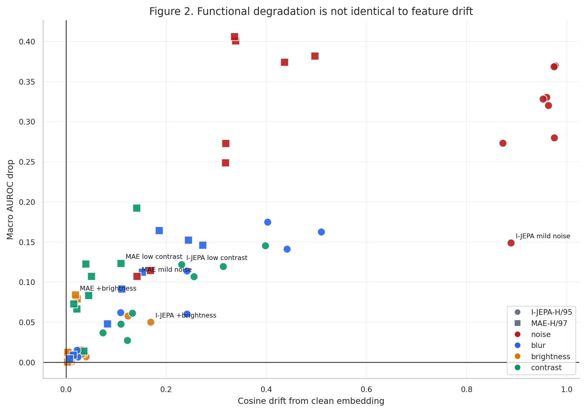

**Exp1 核心发现**：

1. **I-JEPA 和 MAE 对噪声的响应模式完全不同——这是 Exp1 最重要的发现**。

   关键是看 AUROC 随噪声强度变化的**趋势差异**，而不是只看单个噪声水平下的排名：

   - I-JEPA：轻噪声下急剧下跌，然后**饱和**。I-JEPA-H/201 从 clean 0.9162 → σ=0.05 时跌到 0.6431（drop=0.273）→ σ=0.10 时 0.5960 → 之后 σ=0.20 和 σ=0.30 基本停在 0.586-0.588，不再继续下降。
   - MAE：随噪声强度**渐进下降**。MAE-H/97 从 clean 0.8951 → 0.7880 → 0.6466 → 0.5210 → 0.5132，每一步都在跌。
   - 结果在轻噪声（σ=0.05, 0.10）下 MAE 优于 I-JEPA，但在重噪声（σ=0.20, 0.30）下 I-JEPA 反超 MAE。例如 σ=0.20 时 I-JEPA-H/201 AUROC=0.5861，MAE-H/97=0.5210，MAE-H/300=0.4902。

   Embedding drift 数据给出了机制层面的对应：
   - I-JEPA-H/201：cosine drift 在 σ=0.05 时已达 0.872，σ=0.10 时 0.963，接近饱和（最大值 1.0），之后几乎不变（0.960, 0.953）。**表征方向在轻噪声下已经"跳变"到一个不同状态，再加更多噪声也不会让它变得更差。**
   - MAE-H/97：drift 随噪声线性增长 0.142 → 0.319 → 0.436 → 0.497。**表征方向随噪声强度持续退化。**

   这两个模式合起来给出的假说是：I-JEPA 的表征对噪声有一个"脆性阈值"——一点点噪声就足以破坏其依赖的细粒度纹理特征，表征跳变到另一个状态；但跳变之后，剩下的高层语义结构（大致解剖布局、器官位置关系等）对噪声强度不敏感，所以 AUROC 不再继续下降。MAE 的表征没有这个阈值效应，它随噪声强度连续退化——低噪声时表征仍部分可用（drift 小），高噪声时彻底崩溃。

   这也解释了为什么 I-JEPA-H/201（clean 最强）在轻噪声下表现最差：更长的预训练让它更充分地利用了细粒度纹理信息来做判别，这些信息恰好是轻噪声首先破坏的。

2. **I-JEPA 对亮度相对稳定，对 blur 和 contrast 处于中间水平**。亮度±0.1 下 I-JEPA 几乎没有下降。Blur σ=3.0 时 I-JEPA-H/95 的 drop（0.175）略大于 MAE-H/97（0.146）。Blur 下的 drift 模式：I-JEPA 的 drift 随 blur 强度增长比 MAE 更快（H/201: 0.024 → 0.242 → 0.441 → 0.510；MAE-H/97: 0.007 → 0.111 → 0.244 → 0.273），但 blur 不像噪声那样有"阈值跳变"效应，更接近渐进退化。

3. **MAE-H/300 在多个条件下比 MAE-H/97 更差**。噪声 σ=0.30 下 AUROC 从 0.5132 降到 0.4849；contrast 0.25 下从 0.7718 降到 0.6987。MAE 继续训练不是单调改善，某些条件下反而退化。

4. **I-JEPA-H/201 vs H/95 的对比验证了"更长的预训练→更强的纹理依赖→更明显的脆性阈值"**。H/201 clean 比 H/95 高（0.9162 vs 0.9105），但轻噪声下 H/201 跌得更狠（σ=0.05 时 0.6431 vs 0.7616）。重噪声下 H/201 反而高于 H/95（σ=0.20 时 0.5861 vs 0.5408）——因为 H/201 的"跳变后平台"更高，说明其学到的高层语义结构也更强。

**学到什么**：说"I-JEPA 对噪声敏感"不够精确。更准确的说法是——I-JEPA 的表征对噪声有一个**脆性阈值**：极轻的噪声就足以破坏其依赖的细粒度特征（表征跳变），但跳变后剩余的高层语义信息对噪声强度不敏感。MAE 没有这种阈值效应，表征随噪声强度连续退化。这意味着 I-JEPA 的噪声问题不是"学得不够好"，而是其表征中**细粒度纹理和全局语义之间的耦合方式**与 MAE 根本不同。

**还不确定什么，引出 Exp3**：

Exp1 用 Gaussian noise 发现了脆性阈值现象，但 Gaussian noise 是宽频的——它在所有频率上同时加随机扰动。所以这个发现引出一个更精确的问题：

> I-JEPA 的脆性阈值到底是由哪个频率段触发的？

具体来说有三种可能：
- 可能是**高频颗粒**（细边缘、纹理噪声）触发了跳变——轻噪声首先污染这些，再加更多噪声也不会更糟
- 可能是**中频纹理**（组织密度渐变、血管边缘）是关键——这些被破坏后分类就崩了
- 也可能阈值不是单一频率段的问题，而是任意频率的破坏达到某个量级就会触发

Exp3 的做法是把宽频噪声按频段拆开，用 band corruption（在特定频段内注入随机噪声，其他频段保留原图）逐一测试，看哪个频段的破坏能复现 Exp1 的 I-JEPA 崩塌。

### 3.3 Exp3：频率敏感性分析（机制定位）

**实验逻辑**：Exp1 发现 I-JEPA 对宽频 Gaussian noise 有脆性阈值响应。Exp3 用 band corruption 把噪声限制在特定频段，逐一测试 low/mid/high 三个频段，定位到底是哪个频率成分触发了 I-JEPA 的性能崩塌。

**实验设计**：对同一 held-out split 施加三个频段的 band corruption——低频（0.00-0.20）、中频（0.20-0.45）、高频（0.45-1.00）。在目标频段内注入随机噪声替换原有频率成分，其他频段保留原图。报告 Macro AUROC、AUROC drop 和 cosine drift。

**频率扰动可视化**：

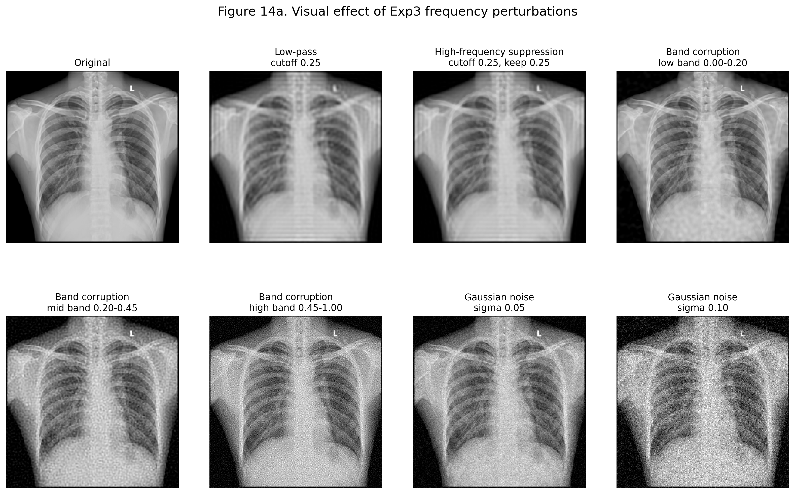

**三个频段的 band corruption 结果**（AUROC，括号内为 drop 和 cosine drift d）：

| 频段 | I-JEPA-H/95 | I-JEPA-H/201 | MAE-H/97 | MAE-H/300 |
|---|---|---|---|---|
| Low (0.00-0.20) | .869 (d .042; d .10) | .855 (d .061; d .14) | .871 (d .024; d .02) | .848 (d .042; d .02) |
| **Mid (0.20-0.45)** | **.605** (d .306; d .85) | **.614** (d .302; d .88) | .761 (d .134; d .12) | .741 (d .150; d .14) |
| **High (0.45-1.00)** | .719 (d .191; d .97) | **.651** (d .265; d .93) | .764 (d .131; d .20) | .724 (d .167; d .21) |

> 对照：Exp1 中 I-JEPA-H/201 在 Gaussian noise σ=0.05 下 AUROC=0.643, drop=0.273, drift=0.872。

**Exp3 核心发现**：

1. **破坏中频段（0.20-0.45）触发 I-JEPA 最大崩塌**。I-JEPA-H/201 AUROC 跌至 0.614（drop=0.302, drift=0.88），I-JEPA-H/95 跌至 0.605（drop=0.306, drift=0.85）。崩塌幅度和 drift 水平与 Exp1 中 Gaussian noise σ=0.05 相当（drop=0.273, drift=0.87）。MAE-H/97 在同条件下 AUROC=0.761（drop=0.134），受影响远小于 I-JEPA。

2. **高频段（0.45-1.00）破坏的 I-JEPA 崩塌程度次之**。I-JEPA-H/201 AUROC=0.651（drop=0.265, drift=0.93），MAE-H/97 AUROC=0.764（drop=0.131, drift=0.20）。

3. **低频段（0.00-0.20）破坏对所有模型影响都小，I-JEPA 和 MAE 之间无明显分化**。I-JEPA-H/201 AUROC=0.855（drop=0.061），MAE-H/97 AUROC=0.871（drop=0.024）。

**回扣 Exp1 的脆性阈值**：

三个频段的结果给出一个清晰的梯度：**破坏的频段越高中频，I-JEPA 崩塌越严重，而 MAE 的受影响程度在所有频段都相对均匀**。

Exp1 的脆性阈值可以用这个梯度来解释：
- Gaussian noise σ=0.05 的噪声功率已经足以污染中/高频段 → 触发 I-JEPA 的脆性崩塌 → AUROC 从 0.91 跌至 ~0.64
- σ=0.10 以上增加的噪声功率主要增加在低频段 → 但 I-JEPA 对低频破坏不敏感 → AUROC 不再继续下降 → 停在 ~0.59 的平台

也就是说，脆性阈值的物理对应是：**I-JEPA 对中/高频段的纹理和边缘信息高度依赖，这些信息在轻噪声下就被完全破坏（drift → 1.0）；剩余的低频结构信息（解剖轮廓、器官位置）对噪声强度不敏感，所以 AUROC 进入平台。**

**学到什么**：I-JEPA 的噪声脆弱性不是均匀的——它对中/高频段有选择性的高度敏感，对低频段不敏感。这个梯度解释了 Exp1 的脆性阈值。MAE 对三个频段的响应更均匀，没有明显的频段选择性崩塌。

**还不确定什么**：为什么 I-JEPA 在中/高频被破坏后还能靠剩余低频信息维持 ~0.59 的 AUROC？这两个"模式"（正常利用中高频 vs 降级到纯低频）是 encoder 中不同层的贡献，还是同一层在输入频谱变化后激活了不同的 feature 子集？

### 3.4 Line 1 小结：从现象到机制的完整逻辑链

1. **Exp1 发现脆性阈值现象**：I-JEPA 在轻 Gaussian noise（σ=0.05）下 AUROC 崩塌（drop=0.273, drift=0.87），但重噪声下不再继续崩（AUROC 停在 ~0.59）。MAE 没有阈值效应——随噪声强度渐进退化。

2. **Exp3 用 band corruption 定位到频段敏感性梯度**：单独破坏中频段（0.20-0.45）就能触发与 Exp1 轻噪声同等的崩塌（drop=0.302, drift=0.88）；高频段破坏的崩塌次之（drop=0.265）；低频段破坏影响很小（drop=0.061）。I-JEPA 对频段有选择性崩塌，MAE 对三个频段响应均匀。

3. **两实验拼起来的机制假说**：I-JEPA 的 clean 优势建立在充分利用中高频纹理/边缘信息上。轻噪声的功率足以饱和中/高频段 → 表征跳变（drift → 1.0）→ AUROC 从 0.91 跌至 ~0.64。剩余的低频结构信息对噪声不敏感 → AUROC 进入平台 ~0.59。

**已确认**：
- I-JEPA clean 表征强（0.9162），MAE-H/300 为 0.8909
- I-JEPA 的噪声响应是"脆性阈值"型（轻噪声崩→平台），MAE 是"渐进退化"型
- 脆性阈值对中/高频段有选择性——I-JEPA 的崩塌不是对"噪声"整体，而是对特定频段的破坏
- MAE 对三个频段的响应更均匀，没有频段选择性崩塌

**待验证**：
- 中高频依赖是 JEPA 架构特性还是训练时长效应？（无 I-JEPA-H/300）
- 为什么 MAE 也接触中高频信息（重建需要），但它没有脆性阈值？

**对 JEPA 改进的启示**：如果脆性阈值是真机制，那么单纯加 noise augmentation 可能不够——需要在预训练阶段让 encoder 学会在"纹理缺失"时平稳退化，而不是跳变。

---

## 4. Line 2 — 病灶敏感性诊断

核心问题：I-JEPA 是否对医生标注的病灶区域有响应？如果有，响应是否真正落在病灶内部？

### 4.1 Exp2b：类别对齐的病灶遮挡实验（发现问题）

**实验设计（这是旧版 Exp2 的重大修复）**：
- 分析单位从"整张图所有 bbox"改为 `(image_id, class_name)`
- 只纳入该类别为阳性且存在同类 bbox 的样本
- 只遮盖该类别的 bbox，多个同类 bbox 先合并成一个 lesion mask
- 每个 lesion mask 生成 5 个面积、形状、纵向位置相似且不覆盖任何 bbox 的 control masks
- bbox 坐标已从原始图像尺寸正确缩放到 1024（修复了早期 bbox 飘到背景的问题）

**Overall 结果**：

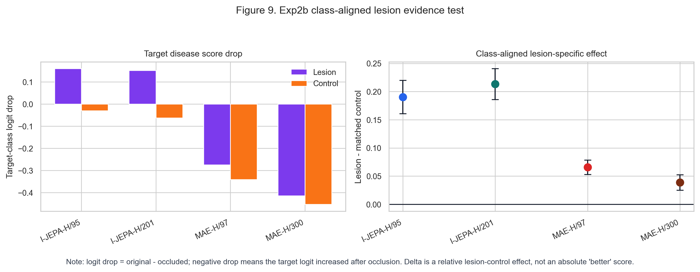

| 模型 | n | Lesion logit drop | Control logit drop | Delta | 95% CI |
|---|---|---|---|---|---|
| I-JEPA-H/95 | 2873 | **+0.1600** | −0.0304 | +0.1904 | [+0.1610, +0.2201] |
| I-JEPA-H/201 | 2873 | **+0.1512** | −0.0622 | **+0.2134** | [+0.1858, +0.2408] |
| MAE-H/97 | 2873 | −0.2743 | −0.3401 | +0.0658 | [+0.0530, +0.0784] |
| MAE-H/300 | 2873 | −0.4138 | −0.4526 | +0.0389 | [+0.0252, +0.0525] |

**解读**：
- I-JEPA 的 lesion drop 为正、control drop 为负、delta 为正且显著——遮挡病灶确实降低了对应类别 logit，且效果大于 matched control。这是**好解释的结果**。
- MAE 的 lesion drop 和 control drop 都是负数（遮挡后 logit 反而上升），delta 虽然为正但绝对值很小。这**很难解释**——遮挡 artifact 的效应可能超过了区域信息损失。不能解释为 MAE "也依赖病灶"。
- MAE-H/300 的 delta（0.0389）比 MAE-H/97（0.0658）更小，长训练没有让 MAE 的病灶遮挡响应更清晰。

**分组结果（localized vs diffuse/global）**：

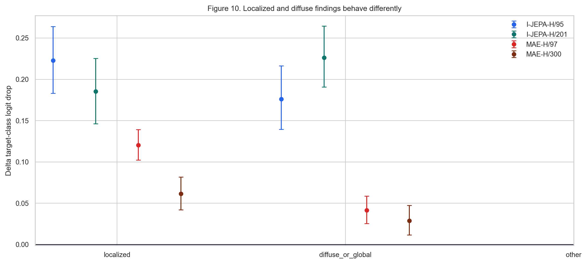

| 模型 | 疾病组 | n | Delta logit drop | 95% CI |
|---|---|---|---|---|
| I-JEPA-H/95 | diffuse_or_global | 1983 | +0.1759 | [+0.1393, +0.2162] |
| I-JEPA-H/95 | localized | 890 | **+0.2227** | [+0.1830, +0.2637] |
| I-JEPA-H/201 | diffuse_or_global | 1983 | +0.2260 | [+0.1905, +0.2645] |
| I-JEPA-H/201 | localized | 890 | +0.1852 | [+0.1462, +0.2252] |
| MAE-H/97 | diffuse_or_global | 1983 | +0.0414 | [+0.0252, +0.0584] |
| MAE-H/97 | localized | 890 | +0.1201 | [+0.1022, +0.1391] |
| MAE-H/300 | diffuse_or_global | 1983 | +0.0287 | [+0.0114, +0.0473] |
| MAE-H/300 | localized | 890 | +0.0614 | [+0.0418, +0.0816] |

注：localized vs diffuse/global 是人为分析分组，不是数据集原生标签，只帮助解释趋势。

在 localized 组上，所有模型的 delta 都更大，说明局部病灶区域的遮挡效应确实更明显。但 I-JEPA 在两个组上的 delta 绝对值都远超 MAE。

**Per-class heatmap**：

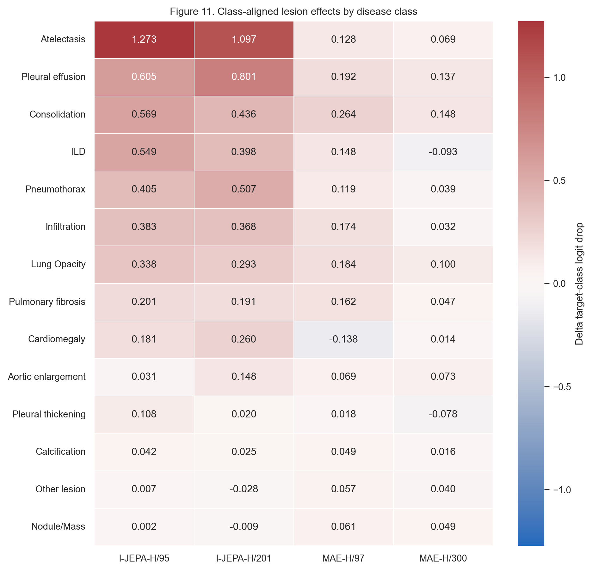

**Bbox area response（遮挡面积对 delta 的影响）**：

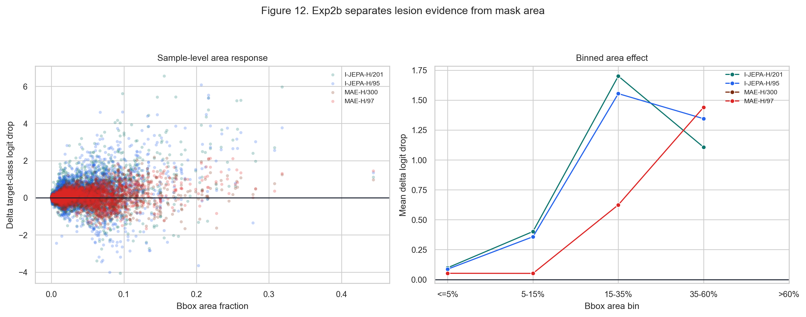

用 bbox area fraction 分箱（≤5%、5-15%、15-35%、35-60%、>60%）检查面积是否混杂遮挡效应。

**代表性 case**：

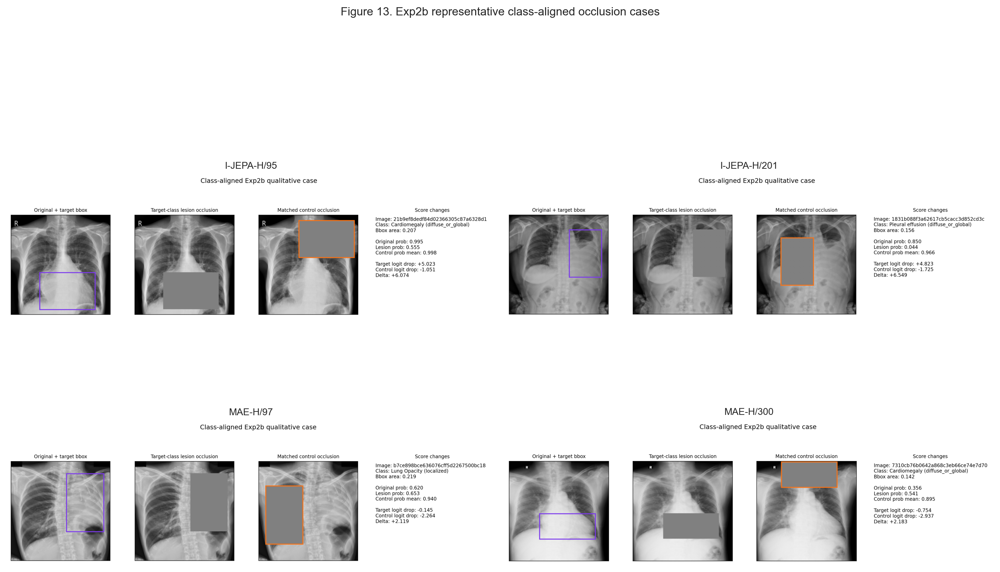

**学到什么**：I-JEPA 对类别对齐的病灶区域有正向统计响应（lesion drop 为正，delta 为正且 CI 不跨零）。这是一个重要的正面发现——I-JEPA 没有完全忽略局部病灶信息。但 delta 的值（~0.19-0.21 logit 单位）并不大，且我们还不知道响应是否精确落在病灶边界内。

**还不确定什么**：I-JEPA 的病灶响应到底落在哪里？是病灶内部、边缘、还是周围的肺野上下文？这引出了 Exp4。

### 4.2 Exp4：Token drift 与 saliency-bbox 对齐（机制定位）

**实验设计**：
- 计算 clean vs noise、clean vs lesion occlusion、clean vs control occlusion 下每个 token 的 cosine drift
- 对 target-class logit 做 gradient × activation saliency
- 计算 inside-bbox saliency ratio、pointing game hit rate、soft IoU

**完整结果**（n=600，localized=97，diffuse/global=503）：

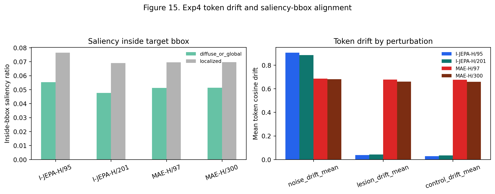

| 模型 | 组别 | n | inside saliency ratio | pointing hit | soft IoU | noise drift | lesion drift | control drift |
|---|---|---|---|---|---|---|---|---|
| I-JEPA-H/95 | diffuse/global | 503 | 0.0553 | 0.0278 | 0.0038 | 0.9066 | 0.0374 | 0.0264 |
| I-JEPA-H/95 | localized | 97 | 0.0764 | 0.1031 | 0.0038 | 0.8959 | 0.0378 | 0.0368 |
| I-JEPA-H/201 | diffuse/global | 503 | 0.0476 | 0.0398 | 0.0031 | 0.8915 | 0.0433 | 0.0330 |
| I-JEPA-H/201 | localized | 97 | 0.0690 | 0.0309 | 0.0036 | 0.8488 | 0.0412 | 0.0432 |
| MAE-H/97 | diffuse/global | 503 | 0.0512 | 0.0577 | 0.0035 | 0.6829 | 0.6745 | 0.6728 |
| MAE-H/97 | localized | 97 | 0.0694 | 0.1031 | 0.0035 | 0.7003 | 0.6954 | 0.6935 |
| MAE-H/300 | diffuse/global | 503 | 0.0513 | 0.0497 | 0.0035 | 0.6778 | 0.6576 | 0.6547 |
| MAE-H/300 | localized | 97 | 0.0696 | 0.0928 | 0.0035 | 0.6913 | 0.6764 | 0.6765 |

**Exp4 核心发现**：

1. **Saliency-bbox overlap 整体极低**。soft IoU 在所有模型上都只有 0.003-0.004，inside saliency ratio 在 0.05-0.08 之间。localized 组略高于 diffuse/global 组（如 I-JEPA-H/95：0.0764 vs 0.0553），但绝对数值仍然很低。说明无论是 I-JEPA 还是 MAE，**预测证据都不是集中在 bbox 内部的**。

2. **I-JEPA 的 noise drift 极高，lesion/control drift 很低**。I-JEPA-H/201 在 noise 下的 token drift 为 0.8488-0.8915（与 Exp1/Exp3 一致），但 lesion 和 control occlusion 下的 drift 只有 0.03-0.04。这给出了一个清晰的对比：**Gaussian noise 对 I-JEPA 表征的影响远大于物理遮挡病灶区域**。噪声在全局范围内破坏 token 表征，而遮挡只影响少数 token。

3. **MAE 的 lesion/control drift 极高（0.65-0.70）且不可区分**。MAE 在 lesion 和 control occlusion 下的 drift 数值都很高而且几乎相等。这说明 MAE 的 token 层对遮挡 artifact（sudden zero-value patches）本身非常敏感，不是因为病灶语义信息被移除。这和 Exp2b 中 MAE 的负 logit drop 是对应的——遮挡产生了强烈的 artifact 信号。

4. **I-JEPA 的 noise drift 远大于 lesion/control drift**，但 MAE 的 noise drift（~0.68-0.70）和 lesion/control drift（~0.65-0.70）在同一量级。这也是为什么 Exp1 中 MAE noise 下 AUROC 也下降了——虽然 cosine drift 绝对值不大，但 token 级别的混乱程度很高。

**解释**：

Exp2b 告诉我们 I-JEPA 对病灶区域有统计敏感性。Exp4 告诉我们，这种敏感性**不是精确空间对齐的**。预测证据分散在病灶周围、肺野结构或全局上下文中。这符合 JEPA 的预训练目标——它预测的是 context block 和 target block 之间的关系，而不是像素级定位。

**学到什么**：I-JEPA 的病灶响应是粗粒度的——模型使用了病灶相关区域的信息，但 saliency 不精确落在 bbox 边界内。不能声称"精确病灶定位"。但这也不代表病灶信息没有被使用——更可能是病灶信息被嵌入到了一个分布式的上下文表示中。

**还不确定什么**：
- 低 saliency-bbox overlap 是 encoder 表征本身的问题，还是 global average pooling + linear probe 的限制？（mean pooling 可能压缩了空间信息）
- 如果用 attention pooling 或 nonlinear adapter，空间对齐会不会改善？

### 4.3 Line 2 小结

**已确认**：
- I-JEPA 对病灶区域有正向统计响应（lesion logit drop 为正，delta 为正且 CI 不跨零）
- 这种响应不是精确空间定位——saliency 不在 bbox 内部（soft IoU ~0.003）
- MAE 的病灶遮挡行为难以解释（lesion/control drop 均为负，遮挡 artifact 影响大）
- MAE token 层对遮挡很敏感（lesion/control drift ~0.67），I-JEPA token 层对遮挡不敏感但对噪声很敏感

**待验证**：
- 下游 probe 结构（非线性、attention pooling）能否改善空间对齐？
- 病灶信息是被"分布式嵌入上下文"了还是根本没用？

**对 JEPA 改进的启示**：如果希望模型对局部病灶更敏感，可以考虑在下游阶段引入 lesion-aware 信号（如 bbox-aware crop/consistency），或修改 JEPA 预训练的 target block 采样策略。

---

## 5. 缓解尝试（Exp5 + Exp6，简要）

**这两个实验不是贡献，是初步试探**，用来验证前面诊断出的问题是否可以被缓解，从而交叉验证我们对问题性质的理解。

### Exp5：Denoise + Robust Probe

测试两个低成本方案：测试时对 noisy image 做 denoise preprocessing（Gaussian smoothing / median filter）；或训练 probe 时加入轻噪声、亮度、对比度增强。

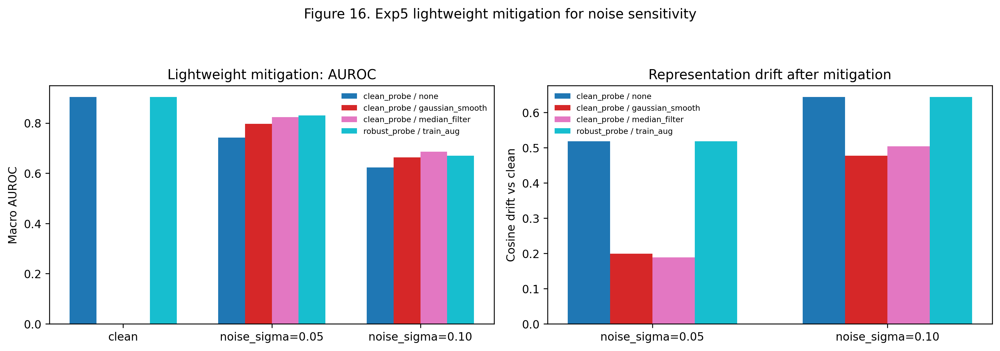

| 模型 | 条件 | 原始 AUROC | 最好 denoise AUROC | robust probe AUROC |
|---|---|---|---|---|
| I-JEPA-H/95 | noise 0.05 | 0.7647 | 0.8239 | **0.8496** |
| I-JEPA-H/95 | noise 0.10 | 0.6336 | 0.6035 | **0.7032** |
| I-JEPA-H/201 | noise 0.05 | 0.6434 | **0.8107** | 0.8048 |
| I-JEPA-H/201 | noise 0.10 | 0.5928 | 0.6333 | **0.6614** |
| MAE-H/97 | noise 0.05 | 0.7887 | 0.8332 | **0.8443** |
| MAE-H/97 | noise 0.10 | 0.6486 | **0.7694** | 0.6692 |
| MAE-H/300 | noise 0.05 | 0.7711 | **0.8325** | 0.8242 |
| MAE-H/300 | noise 0.10 | 0.6182 | **0.7386** | 0.6456 |

关键观察：
- 对 I-JEPA-H/201，median filter 能把 noise 0.05 AUROC 从 0.6434 提升到 0.8107（+0.167）——输入端高频噪声确实是重要因素
- 但对 I-JEPA-H/201 noise 0.10，两种方法提升都很有限（最好 0.6614），说明重噪声下输入端处理已经不够了
- 这些方法都不能降低 encoder 层面的 cosine drift（仍在 0.87-0.89）

### Exp6：Noise-Consistent Adapter (NCA)

NCA 在冻结 encoder 上加一个可训练的 residual MLP adapter + 分类头，训练时约束 clean/noisy 表征的预测一致性。

**重要前提**：NCA 加了可训练的 adapter 参数（模型容量变大），性能提升是预料之中的。NCA 的价值在于测试"一致性约束方向是否有效"，而不是说 NCA 本身是最优方案。

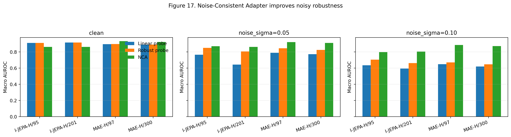

| 模型 | 方法 | Clean AUROC | Noise 0.05 AUROC | Noise 0.10 AUROC |
|---|---|---|---|---|
| I-JEPA-H/95 | linear probe | 0.9105 | 0.7647 | 0.6336 |
| I-JEPA-H/95 | robust probe | 0.9115 | 0.8496 | 0.7032 |
| I-JEPA-H/95 | NCA | 0.8610 | **0.8705** | **0.7967** |
| I-JEPA-H/201 | linear probe | **0.9162** | 0.6434 | 0.5928 |
| I-JEPA-H/201 | robust probe | **0.9162** | 0.8048 | 0.6614 |
| I-JEPA-H/201 | NCA | 0.8621 | **0.8617** | **0.8035** |
| MAE-H/97 | linear probe | 0.8951 | 0.7887 | 0.6486 |
| MAE-H/97 | robust probe | 0.8966 | 0.8443 | 0.6692 |
| MAE-H/97 | NCA | **0.9327** | **0.9204** | **0.8861** |
| MAE-H/300 | linear probe | 0.8909 | 0.7711 | 0.6182 |
| MAE-H/300 | robust probe | 0.8906 | 0.8242 | 0.6456 |
| MAE-H/300 | NCA | **0.9223** | **0.9110** | **0.8721** |

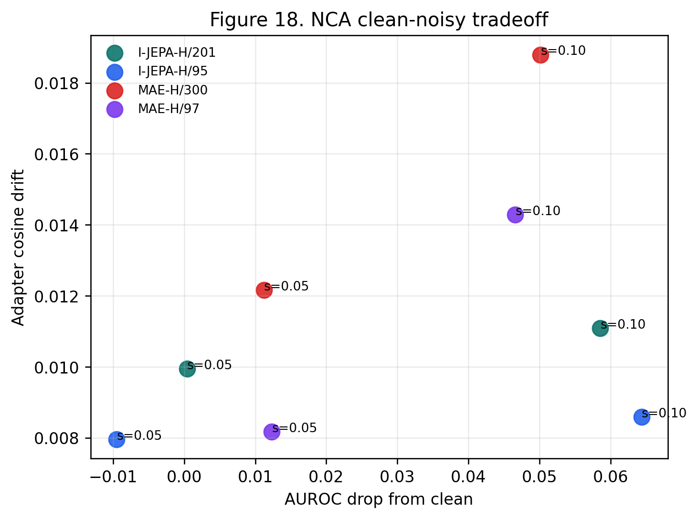

**关键观察（不 overclaim）**：

1. NCA 显著提升 noisy AUROC。I-JEPA-H/201 noise 0.10 从 0.5928→0.8035（+0.211）；MAE-H/300 noise 0.10 从 0.6182→0.8721（+0.254）。说明噪声退化不是完全不可逆的。

2. **但 I-JEPA 有明显的 clean-robustness tradeoff**。I-JEPA-H/201 clean 从 0.9162→0.8621（−0.054）。NCA 把 noisy 性能拉回来是以牺牲 clean 性能为代价的。

3. MAE 从 NCA 中获益更稳定——clean + noisy 三条件全提升。这提示 MAE 的表征中可能保留了信息，但 linear probe 无法充分读出。

4. **NCA 没有改变 raw encoder drift**。I-JEPA-H/201 noise 0.05 下 encoder 层 drift 仍是 0.874，但 adapter 层 drift 被压到 0.010。NCA 的机制是"在 encoder 之后学一个更稳定的映射"，不是"修复 encoder"。

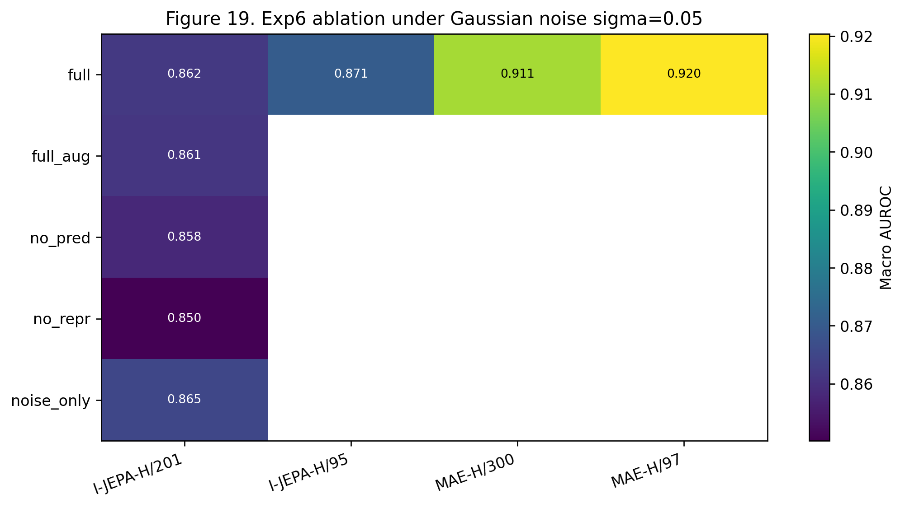

I-JEPA-H/201 的 ablation 显示：去掉 representation consistency 后，adapter drift 明显变大，noise 0.05 AUROC 也从 0.8617 降到 0.8502；去掉 prediction consistency 的影响相对温和。

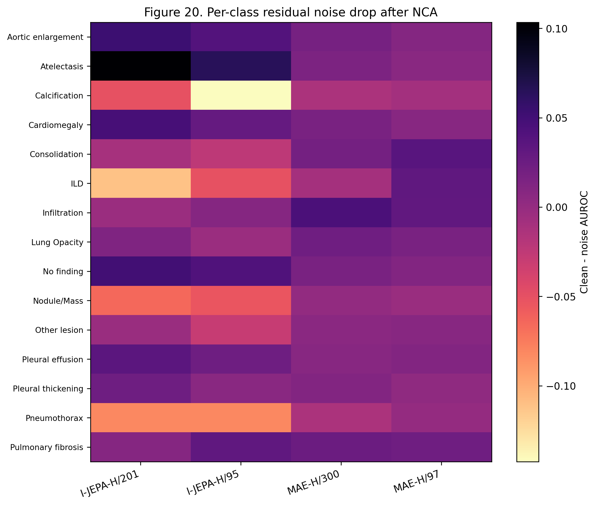

**NCA 的定位**：它证明了"clean/noisy consistency 是有用的训练信号"，但 NCA 本身：
- 加了可训练参数（模型容量变大）
- 没有解决 encoder 层的问题
- 对 I-JEPA 有 clean tradeoff
- 更适合作为"方向验证"而非最终方案

真正的改进应该把一致性约束前移到预训练阶段。

---

## 6. 综合讨论：两条线合起来告诉我们什么

### 6.1 I-JEPA 的完整行为画像

| 维度 | 观察 | 证据强度 |
|---|---|---|
| Clean 分类 | 强于 MAE（H/201: 0.9162），longer training 有正向趋势 | 强（4 模型，同一 split） |
| 亮度/对比度鲁棒性 | 尚可，但 I-JEPA-H/201 在极端 contrast 下漂移比 H/95 大 | 中（单个 split） |
| 高频/噪声鲁棒性 | 弱，encoder 层 drift 达 0.87-0.96，中频 band corruption 下 AUROC 跌至 0.61 | 强（Exp1+Exp3 交叉验证，multi-seed） |
| 病灶统计敏感 | 有正向响应（lesion drop 正，delta 正且显著） | 中（Exp2b 单个方法） |
| 病灶空间精确 | 弱，saliency 不在 bbox 内（soft IoU ~0.003） | 中（Exp4，只做了单层 saliency） |

### 6.2 I-JEPA 的核心矛盾

I-JEPA 的强项和弱项可能来自**同一个源头**：

- I-JEPA 预测的是 target encoder 的高层 latent representation，不重建像素。这让它学到了更抽象的语义结构（clean AUROC 高，病灶响应方向有意义）。
- 但在胸片里，关键的判别信息可能就在局部纹理、边缘和密度模式中——这些恰好是中高频信息。JEPA 依赖这些来构建高层语义预测，因此当这些被噪声破坏时，表征大幅漂移。
- 病灶方面：JEPA 学到了"这个大致的解剖区域 + 上下文"是有意义的，但它没有信号去学习精确边界，因为预测目标本身就是高层表示，不需要边界精度。

**一句话**：I-JEPA 在全局语义建模上有优势，但在局部细粒度信号的处理上存在张力。这不是 bug，而是 JEPA "预测高层表示而非像素"这个设计哲学在医学影像领域暴露出的特征。

### 6.3 MAE 的位置

MAE 更像一个"对局部纹理不那么敏感、但全局语义也较弱"的 baseline：

- 噪声下 drift 小（~0.14-0.17），因为它重建像素，学到的可能是更平滑、更低频的结构信息
- 但 clean 分类和病灶响应都不如 I-JEPA
- Token 层对遮挡 artifact 极其敏感（drift ~0.67），因为 MAE 训练时见过大量 masked patches，对 zero-value patch 有强烈反应
- 训练 300 epoch 没有让这些模式发生本质改变

MAE 的存在帮助我们理解：JEPA 的优势和劣势是 JEPA 特有的 tradeoff，不是所有 SSL 方法共有的。

---

## 7. 当前未解决的关键问题

按优先级排列：

1. **中高频依赖是 JEPA 架构的必然结果还是训练不足？** 目前 I-JEPA 只有 201 ep（没有 300ep checkpoint），无法判断更长训练会不会缓解还是加剧这个问题。

2. **病灶响应的空间精度不够，是 encoder 的问题还是 probe 的问题？** 当前只测了 global average pooling + linear probe。如果换 attention pooling 或 nonlinear adapter，空间对齐结果可能不同。

3. **遮挡实验的 artifact effect 有多大？** 遮挡引入了 edge 和零值区域。MAE 对这些特别敏感（token drift ~0.67）。需要用更干净的 ablation 方法（如 inpainting 或不同填充值）。

4. **I-JEPA clean 优势和噪声脆弱性是否可以解耦？** NCA 的结果暗示这不容易（clean 下降 0.054 换 noisy 上升 0.21）。有没有保留 clean 的同时降低 noise drift 的方法？

5. **这些发现对数据集是否特异？** 目前只有一个下游数据集（VinDr-CXR）。疾病谱、数据分布、标注质量都可能影响结论。

6. **病灶"统计敏感性"对临床够不够？** 如果模型看大致区域+上下文就能做出正确诊断，精确定位是不是不需要？（这是医学问题，不是技术问题。）

---

## 8. 下一步：基于观察提出 JEPA 改进方向

以下是基于两条诊断线的观察提出的可能改进方向，按改动成本从低到高排列。

### 8.1 下游 lesion-aware consistency（低成本先验证）

- **动机**：Line 2 发现病灶响应是粗粒度的，saliency 不精确
- **思路**：在下游 probe/adapter 训练时加入 bbox-aware crop consistency（crop 病灶区域 vs 非病灶区域，约束表示差异）
- **风险**：bbox 标注不完整可能导致负采样错误
- **优势**：不需要重新预训练

### 8.2 预训练阶段加入 perturbation consistency

- **动机**：Line 1 发现 embedding 在噪声下大幅漂移
- **思路**：在 I-JEPA 预训练中，对同一张图的 clean 和 perturbed 版本，约束 context encoder 输出或 predictor 输出保持一致
- **需要回答的问题**：在 encoder 层还是 predictor 层做约束？扰动强度怎么选？会不会损害 clean semantic learning？
- **风险**：可能削弱 JEPA 对有用细粒度特征的敏感性

### 8.3 修改 JEPA 的 target block 采样策略

- **动机**：Line 2 发现病灶响应粗粒度
- **思路**：引入多尺度 target block（含更小、更局部的 target），或让 predictor 同时预测 patch-level 和 region-level 表示
- **风险**：过小的 target 可能让任务退化到 texture completion

### 8.4 预训练中引入频率感知的 data augmentation

- **动机**：Exp3 发现中高频依赖
- **思路**：预训练中随机对 context block 做 frequency band augmentation，迫使模型不依赖单一频率带
- **风险**：类似 data augmentation，可能只是表面缓解

### 8.5 验证其他 JEPA 变体

- **动机**：目前只测试了 I-JEPA
- **思路**：如果条件允许，测试 MC-JEPA 或 V-JEPA 在胸片上的行为，帮助区分"JEPA 架构共性"和"I-JEPA 设计选择"

---

## 9. 答辩用核心叙事（草稿）

> 我没有急着下结论说 I-JEPA 好还是 MAE 好。我沿着两条线做了诊断。
>
> **鲁棒性线（Exp1→Exp3→Exp5→Exp6）**：I-JEPA 的 clean 表征确实更强（AUROC 0.9162），但它对 Gaussian noise 和中/高频扰动非常敏感。σ=0.05 的轻噪声下，I-JEPA-H/201 AUROC 从 0.9162 跌到 0.6431（drop=0.273），embedding drift 达 0.87。Exp3 把这个脆弱性定位到了中高频段——中频 band corruption 下 AUROC 只剩 0.614。Exp5 的 denoise 和 robust probe 能拉回一部分，但不能降低 encoder drift。Exp6 的 NCA 在下游做一致性适配可以把 noisy AUROC 拉回来，但这是加参数换来的（clean 从 0.9162 跌到 0.8621），encoder 本身仍然不稳定。
>
> **病灶敏感性线（Exp2b→Exp4）**：I-JEPA 对病灶区域有正向响应——遮挡病灶确实降低对应类别 logit（delta=+0.21，CI 不跨零）。但 Exp4 显示这个响应不是精确空间对齐的——saliency soft IoU 只有 0.003，预测证据分散在病灶周围和上下文中。所以 JEPA 学到的是粗粒度的区域+上下文敏感性，不是精确病灶定位。
>
> 两条线合起来指向同一个核心矛盾：JEPA 通过预测高层表示学到了很强的全局语义，但在胸片里，关键的判别证据存在于它不擅长的局部细粒度信号中。后续改进的重点是在保留 I-JEPA 全局语义优势的前提下，增强其对局部信号的空间精度和噪声稳定性。

---

## 10. 附录：图表索引

| 图 | 内容 |
|---|---|
| Fig0 | 不同扰动对原始胸片的视觉影响 |
| Fig1 | Exp1 常规扰动鲁棒性矩阵 |
| Fig2 | AUROC drop 与 representation drift |
| Table 1 | Complete Exp1 robustness summary |
| Fig9 | Exp2b 类别对齐遮挡 overall 结果 |
| Fig10 | Exp2b localized vs diffuse/global 分组 |
| Fig11 | Exp2b per-class heatmap |
| Fig12 | Exp2b bbox area response |
| Fig13 | Exp2b qualitative cases |
| Fig14a | Exp3 frequency perturbation visual examples |
| Fig14 | Exp3 frequency sensitivity by perturbation type |
| Fig14b | Exp3 AUROC drop vs representation drift |
| Table 3 | Complete Exp3 frequency sensitivity summary |
| Fig15 | Exp4 token drift 与 saliency alignment |
| Fig16 | Exp5 lightweight mitigation |
| Fig17 | Exp6 NCA main result |
| Fig18 | Exp6 clean-robustness tradeoff |
| Fig19 | Exp6 ablation |
| Fig20 | Exp6 per-class noise gain |

旧版 Exp2a 图 Fig3-Fig8 保留为补充材料。
