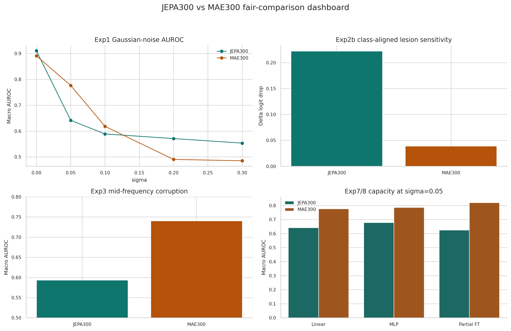
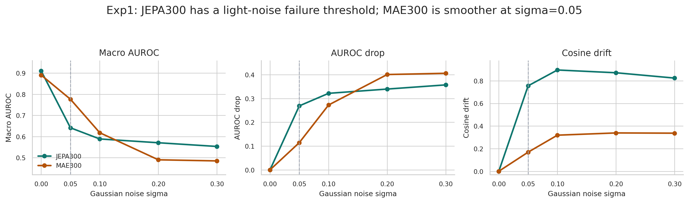
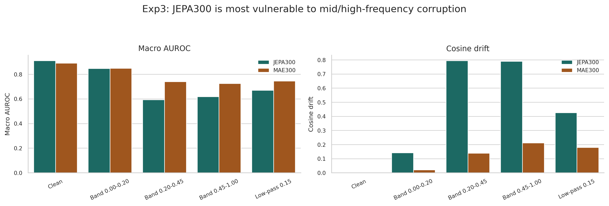
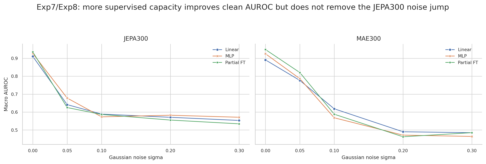
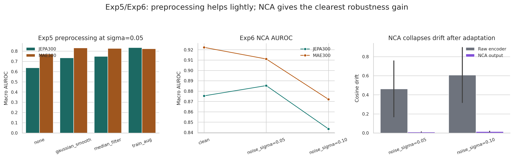
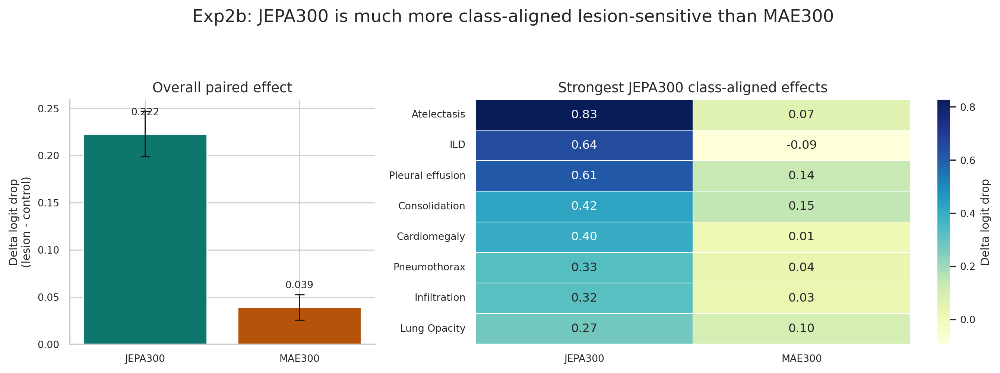
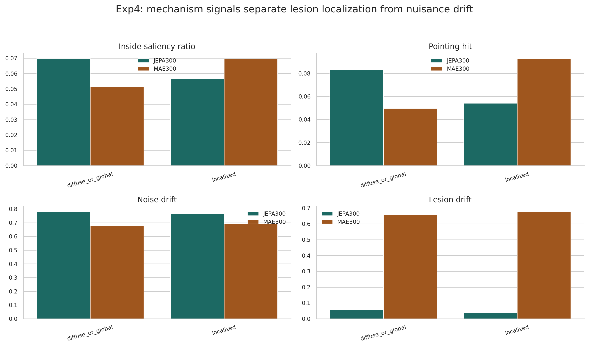

# I-JEPA 胸片自监督表征行为诊断报告

> **目标**：通过对照实验理清 I-JEPA 在胸片中学到了什么，定位优劣势，评估后训练改进策略。
>
> **更新日期**：2026-05-23

---

## JEPA300 Fair-Rerun Status

本版已将主比较切换为 **I-JEPA-H/300 vs MAE-H/300**。I-JEPA-H/201 只作为历史参照，不再作为公平主结论。

- JEPA300 checkpoint：`/home/uic2/zhaoyi/medical-i-jepa/logs/pretrain_mimic_cxr_vith14/jepa-latest.pth.tar`
- UIC 训练日志确认：`Epoch 300/300 complete`，`Checkpoint saved (epoch 300)`，完成于 2026-05-17。
- JEPA300 下游 Exp1–Exp8 已在 UIC 全量完成，汇总文件为 `results/jepa300_fair_summary_full.csv`。
- MAE300 使用既有完整测试结果：`results/exp*_mae_huge_mimic_300ep_fixedsplit/`。
- JEPA250 / JEPA250+50 checkpoint 尚未在 UIC 发现；本版不写入主结论。

### 可视化总览



> 这张总览图把本版公平对比压缩为四个关键读数：JEPA300 保留更强的病灶敏感性，但 MAE300 在轻噪声下更平滑；频率实验和探针/微调实验共同说明，JEPA300 的轻噪声失稳主要来自表征层面，而不是单纯的 probe 容量不足。

## 目录

1. [实验设置](#1-实验设置)
2. [诊断线 A：表征稳定性（噪声鲁棒性）](#2-诊断线-a表征稳定性)
   - [2.1 Exp1 — 常规扰动鲁棒性](#21-exp1--常规扰动鲁棒性)
   - [2.2 Exp3 — 频率敏感性定位](#22-exp3--频率敏感性定位)
   - [2.3 Exp7 — 探针容量：问题在编码器还是探针？](#23-exp7--探针容量问题在编码器还是探针)
   - [2.4 Exp8 — 部分微调：重新训练能修复吗？](#24-exp8--部分微调重新训练能修复吗)
   - [2.5 Exp5/Exp6 — 缓解方案](#25-exp5exp6--缓解方案)
3. [诊断线 B：病灶敏感性](#3-诊断线-b病灶敏感性)
   - [3.1 Exp2b — 分类对齐遮挡实验](#31-exp2b--分类对齐遮挡实验)
   - [3.2 Exp4 — Token 漂移与显著性分析](#32-exp4--token-漂移与显著性分析)
4. [后训练改进分析（Golden Checkpoints）](#4-后训练改进分析golden-checkpoints)
   - [4.1 完整噪声鲁棒性曲线：脆性阈值被推移，而非消除](#41-完整噪声鲁棒性曲线脆性阈值被推移而非消除)
   - [4.2 病灶敏感性对比](#42-病灶敏感性对比)
   - [4.3 三种策略的综合评价](#43-三种策略的综合评价)
5. [综合讨论](#5-综合讨论)
6. [关键数据速查表](#6-关键数据速查表)

---

## 1. 实验设置

### 基础预训练模型

| 模型 | 架构 | 预训练 | Clean AUROC |
|------|------|--------|:-----------:|
| **I-JEPA-H/300** | ViT-Huge patch14, 1280-dim | MIMIC-CXR, 300 epochs | **0.910** |
| I-JEPA-H/201 | ViT-Huge patch14, 1280-dim | MIMIC-CXR, 201 epochs | 0.916 |
| I-JEPA-H/95 | ViT-Huge patch14, 1280-dim | MIMIC-CXR, 95 epochs | 0.911 |
| MAE-H/97 | ViT-Huge patch14, 1280-dim | MIMIC-CXR, 97 epochs | 0.895 |
| **MAE-H/300** | ViT-Huge patch14, 1280-dim | MIMIC-CXR, 300 epochs | 0.891 |

### 后训练改进模型（Golden Checkpoints）

后训练谱系如下：v4 从 v3.1（= I-JEPA-H/201）继续训练；v5 和 v6 都从 v4 ep50 warm-start，因此继承了 v4 的 context-target 不对称噪声训练。

| 缩写 | 后训练方式 | Epochs | 原理简述 |
|------|-----------|:------:|---------|
| **v3.1** | 基础预训练（基线） | 201 | — |
| **v4 (+noise)** | Context-target 不对称噪声 | +50 | 学生编码器看加噪图，教师/target 编码器看 clean 图，显式注入噪声不变性 |
| **v5 (+reg)** | Register Tokens + 紧 mask + 继承 v4 噪声 | +60 | 加 4 个 DINOv2 风格 register token，并收紧 mask 策略；`reg` 不是图像配准 |
| **v6 (+vicreg)** | V4 + patch-level var/cov 正则 | +40 | 在 I-JEPA 主损失上加小权重 variance/covariance 辅助项；不是标准 2-view VICReg |

> 三种策略的原理详解见 [附录：后训练策略原理](#附录后训练策略原理)

### 评估协议

- **数据集**：VinDr-CXR / VinBigData（15 类多标签分类，含边界框标注）
- **划分**：确定性 80/20 split（train=12,000, test=3,000, seed=42）
- **默认评估**：冻结编码器 + 线性探针（LinearProbe）
- **扩展评估**：MLP 探针（Exp7）、部分微调（Exp8）
- **指标**：Macro AUROC、Cosine Drift（1 − cosine_similarity）

| 协议 | 容量 | 训练 | 用在 |
|---|---|---|---|
| **LinearProbe** | 1 层 Linear (1280 → 15) + BatchNorm1d | SGD lr=0.1, momentum=0.9, CosineAnnealing, 100 ep, BCEWithLogitsLoss + pos_weight | Exp1, Exp2b, Exp3, Exp5, §4.* 默认 |
| **MLPProbe** | Linear → GELU → Dropout → Linear (512 hidden) | 同 LinearProbe | Exp7 |
| **Partial FT** | 解冻 encoder 最后 2 个 ViT block + LayerNorm + MLP head | AdamW, lr_encoder=1e-5, lr_head=1e-4, 15 ep | Exp8 |

> **协议差异声明**：本报告 AUROC 基于 12,000 train / 3,000 test 的探针评估。上游 V3.1/V4/V5 训练侧 baseline eval 使用 15,000 train / 3,000 test；同一 checkpoint 的 clean AUROC 可能高约 0.02（例如 V3.1 ep201 上游为 0.9373，本报告为 0.916）。跨报告比较应看趋势和符号，不应逐小数点对齐。

---

## 2. 诊断线 A：表征稳定性

> **核心问题**：I-JEPA 对不应改变诊断语义的扰动是否稳定？如果不稳定，问题是在编码器表征层面还是探针/决策边界层面？

### 2.1 Exp1 — 常规扰动鲁棒性



**方法**：对测试图像施加 4 类扰动（高斯噪声 ×4 级、高斯模糊 ×3 级、亮度偏移 ×3 级、对比度缩放 ×2 级），测量分类性能下降和嵌入漂移。

**完整高斯噪声曲线**：

| 模型 | Clean | σ=0.05 | σ=0.10 | σ=0.20 | σ=0.30 |
|------|:-----:|:------:|:------:|:------:|:------:|
| **I-JEPA-H/300** | **0.910** | 0.641 | 0.589 | 0.571 | 0.553 |
| I-JEPA-H/201 | 0.916 | 0.643 | 0.596 | 0.586 | 0.588 |
| I-JEPA-H/95 | 0.911 | 0.762 | 0.631 | 0.541 | 0.542 |
| **MAE-H/300** | 0.891 | **0.777** | **0.618** | 0.490 | 0.485 |

**余弦漂移（Cosine Drift）**：

| 模型 | σ=0.05 | σ=0.10 | σ=0.20 | σ=0.30 |
|------|:------:|:------:|:------:|:------:|
| **I-JEPA-H/300** | **0.755** | 0.895 | 0.871 | 0.824 |
| I-JEPA-H/201 | 0.872 | 0.963 | 0.957 | 0.956 |
| I-JEPA-H/95 | 0.889 | 0.975 | 0.970 | 0.971 |
| **MAE-H/300** | 0.169 | 0.319 | 0.339 | 0.337 |

**核心发现**：

1. **JEPA300 仍然存在"脆性阈值"**：σ=0.05（肉眼几乎不可见）就导致 I-JEPA-H/300 的表征大幅漂移（drift 0.755），AUROC 从 0.910 跌到 0.641。继续增大噪声后 AUROC 基本进入平台区（0.589→0.553），说明表征在轻噪声下已发生主要跳变。

2. **JEPA300 没有解决 JEPA201 的噪声问题**：300 epoch clean AUROC 为 0.910，略低于 JEPA201 的 0.916；σ=0.05 AUROC 为 0.641，几乎复现 JEPA201 的 0.643。更长预训练没有带来自然鲁棒性。

3. **MAE300 在轻噪声下明显更稳**：σ=0.05 时 MAE300 AUROC 0.777，高于 JEPA300 的 0.641；drift 仅 0.169，是 JEPA300 的约 1/4。MAE 的像素重建目标仍然带来更平滑的轻噪声响应。

4. **JEPA300 的高噪声平台略高于 MAE300**：σ=0.20/0.30 下 JEPA300 为 0.571/0.553，MAE300 为 0.490/0.485。这延续了原先观察：I-JEPA 在轻噪声下发生跳变，但跳变后仍保留一部分全局语义平台。

---

### 2.2 Exp3 — 频率敏感性定位



**方法**：在频域施加针对性扰动——低通滤波、高频抑制、**带通噪声**——精确定位 I-JEPA 脆弱性对应的频率范围。

**关键结果**（I-JEPA-H/300）：

| 条件 | AUROC | Drop | Drift |
|------|:-----:|:----:|:-----:|
| Clean | 0.910 | — | — |
| Low-pass cutoff=0.15 | 0.670 | −0.240 | 0.437 |
| **Band corrupt 0.20–0.45** | **0.594** | **−0.317** | **0.752** |
| Band corrupt 0.00–0.20 | 0.847 | −0.063 | 0.110 |
| Band corrupt 0.45–1.00 | 0.618 | −0.292 | 0.622 |

**核心发现**：

1. **JEPA300 的频率脆弱性更宽**：0.20–0.45 频段仍是主脆弱带（AUROC 0.594, drift 0.752），但 0.45–1.00 高频段也明显受损（AUROC 0.618）。这比 JEPA201 更像"中高频整体依赖"，而不是单一中频带。

2. 频段 0.20–0.45 对应胸片中的**细粒度组织纹理**：血管纹理、间质网状结构、骨性边缘。I-JEPA 学会了依赖这些纹理作为判别线索。

3. **MAE300 衰减更渐进**：MAE300 在 0.20–0.45 和 0.45–1.00 的 AUROC 分别约为 0.741 和 0.724，均高于 JEPA300；这进一步说明 JEPA300 的频域敏感性没有随 300 epoch 训练自然消失。

---

### 2.3 Exp7 — 探针容量：问题在编码器还是探针？



> **这是夯实 I-JEPA 噪声脆性本质的关键实验。**

**方法**：将 LinearProbe（单层线性）替换为 MLPProbe（Linear→GELU→Dropout→Linear, 512 hidden dim）。如果 MLP 能修复噪声性能，说明问题在探针容量不足；如果 MLP 反而更差，说明问题在编码器表征本身。

**完整高斯噪声曲线对比**：

| 模型 | 探针 | Clean | σ=0.05 | σ=0.10 | σ=0.20 | σ=0.30 |
|------|------|:-----:|:------:|:------:|:------:|:------:|
| **I-JEPA-H/300** | Linear | 0.910 | 0.641 | 0.589 | 0.571 | 0.553 |
| **I-JEPA-H/300** | **MLP** | 0.927 | **0.678** | 0.573 | 0.582 | 0.571 |
| I-JEPA-H/201 | Linear | 0.916 | 0.643 | 0.596 | 0.586 | 0.588 |
| I-JEPA-H/201 | MLP | 0.928 | 0.470 | 0.538 | 0.565 | 0.558 |
| **MAE-H/300** | Linear | 0.891 | 0.777 | 0.618 | 0.490 | 0.485 |
| **MAE-H/300** | **MLP** | 0.925 | **0.786** | 0.568 | 0.471 | 0.464 |

**以噪声 drop 表示的对比**：

```
                     σ=0.05 drop      方向
JEPA300 Linear:      −0.269
JEPA300 MLP:         −0.249          基本持平/略好
MAE300 Linear:       −0.114
MAE300 MLP:          −0.139          基本持平
```

**核心发现**：

1. **JEPA300 与 JEPA201 在探针容量上的表现不同**：JEPA201 的 MLP 在 σ=0.05 下明显恶化（0.470），而 JEPA300 的 MLP 为 0.678，略高于 linear 的 0.641。但 JEPA300 的噪声 drift 仍然很高，说明更大探针改善了决策边界，却没有修复编码器表征跳变。

2. **MAE300 仍然是轻噪声下更稳的 baseline**：MLP clean 0.925，与 JEPA300 MLP 0.927 接近；但 σ=0.05 下 MAE300 MLP 0.786，高于 JEPA300 MLP 0.678。

3. **Exp7 的结论需要更新**：JEPA300 的问题不能再简单写成"MLP 使 I-JEPA 更差"。更准确的说法是：探针容量可以部分缓解 JEPA300 的轻噪声分类边界，但不能降低 encoder drift，因此问题仍然主要来自编码器表征。

---

### 2.4 Exp8 — 部分微调：重新训练能修复吗？

> **另一个夯实编码器层面问题的关键实验。**

**方法**：解冻编码器最后 2 个 ViT 块 + LayerNorm（~25M 参数），在 clean 数据上微调 15 epochs（lr_encoder=1e-5, lr_head=1e-4）。

**完整高斯噪声曲线对比**：

| 模型 | 方法 | Clean | σ=0.05 | σ=0.10 | σ=0.20 | σ=0.30 |
|------|------|:-----:|:------:|:------:|:------:|:------:|
| **I-JEPA-H/300** | Frozen+Linear | 0.910 | 0.641 | 0.589 | 0.571 | 0.553 |
| **I-JEPA-H/300** | **Partial FT** | 0.935 | **0.625** | 0.587 | 0.555 | 0.534 |
| I-JEPA-H/201 | Frozen+Linear | 0.916 | 0.643 | 0.596 | 0.586 | 0.588 |
| I-JEPA-H/201 | Partial FT | 0.937 | 0.600 | 0.555 | 0.515 | 0.495 |
| **MAE-H/300** | Frozen+Linear | 0.891 | 0.777 | 0.618 | 0.490 | 0.485 |
| **MAE-H/300** | **Partial FT** | 0.949 | **0.820** | 0.588 | 0.462 | 0.485 |

**余弦漂移对比（Partial FT 后）**：

| 模型 | σ=0.05 | σ=0.10 | σ=0.20 | σ=0.30 |
|------|:------:|:------:|:------:|:------:|
| I-JEPA-H/300 Partial FT | **0.780** | 0.868 | 0.775 | 0.680 |
| MAE-H/300 Partial FT | 0.689 | 0.848 | 0.764 | 0.760 |

**核心发现**：

1. **部分微调不能修复 JEPA300 的轻噪声脆性**：clean 性能从 0.910 提升到 0.935，但 σ=0.05 AUROC 仍只有 0.625，低于 frozen linear 的 0.641；drift 仍高达 0.780。微调改善了 clean 决策边界，却没有消除噪声表征跳变。

2. **MAE300 从微调中获得更强轻噪声性能**：clean 达 0.949，σ=0.05 AUROC 0.820，显著高于 JEPA300 的 0.625。但 MAE300 在 σ=0.20/0.30 下仍会严重退化。

3. **Exp7 + Exp8 共同结论**：更大的 MLP 可以部分改善 JEPA300 的轻噪声分类结果，但 partial FT 不能进一步修复；两者都没有降低 encoder drift。因此噪声问题仍应从预训练目标或后训练一致性约束解决。

---

### 2.5 Exp5/Exp6 — 缓解方案



#### Exp5：轻量级预处理

输入图像做去噪预处理（中值滤波 / 高斯平滑）后再编码。σ=0.05 时有轻微帮助，σ=0.10 时无效。预处理是"治标不治本"——噪声已经在编码器内部被放大。

#### Exp6：噪声一致性适配器（NCA）

冻结编码器上插入可训练的残差 MLP 适配器（ResidualAdapterClassifier），用一致性损失训练：clean 预测 ≈ augmented 预测 + 表征对齐。

**I-JEPA NCA 完整噪声谱（冻结编码器 + 残差 MLP 适配器）**：

| 模型 | 配置 | Clean | σ=0.05 | σ=0.10 | σ=0.20 | σ=0.30 |
|------|------|:-----:|:------:|:------:|:------:|:------:|
| I-JEPA-H/201 | Linear (基线) | 0.916 | 0.643 | 0.596 | 0.586 | 0.588 |
| I-JEPA-H/201 | **NCA** | 0.862 | 0.860 | 0.804 | 0.726 | 0.644 |
| I-JEPA-H/95 | Linear (基线) | 0.911 | 0.762 | 0.631 | 0.541 | 0.542 |
| I-JEPA-H/95 | **NCA** | 0.861 | 0.868 | 0.799 | 0.721 | 0.683 |

**MAE NCA 对比**（σ=0.20 和 0.30 的 NCA 数据暂缺）：

| 模型 | 配置 | Clean | σ=0.05 | σ=0.10 |
|------|------|:-----:|:------:|:------:|
| **MAE-H/300** | Linear (基线) | 0.891 | 0.777 | 0.618 |
| **MAE-H/300** | **NCA** | 0.922 | 0.911 | 0.872 |

**适配器漂移 vs 原始漂移（I-JEPA-H/201）**：

| 指标 | σ=0.05 | σ=0.10 | σ=0.20 | σ=0.30 |
|------|:------:|:------:|:------:|:------:|
| 原始编码器 Drift | 0.873 | 0.963 | 0.960 | 0.953 |
| NCA 适配器 Drift | **0.010** | **0.011** | **0.011** | **0.010** |
| 压缩比 | 87× | 88× | 87× | 95× |

**核心发现**：

1. **NCA 的适配器漂移几乎为零（~0.01）**，与噪声强度完全无关。原始编码器的表征在不同噪声下剧烈漂移（0.87–0.96），但经过适配器的残差 MLP 变换后，噪声表征和 clean 表征在适配器输出空间几乎重合。适配器将一个"断裂"的表征流形"拉平"了。

2. **但 clean 性能有 tradeoff**（−0.054）。适配器以降低 clean 判别力为代价换取噪声一致性。NCA 的输出空间是 clean 和噪声之间的"妥协点"——既不完全等于 clean 的最优决策边界，也不被噪声破坏。

3. **MAE 的 NCA 完全不同**：clean 和噪声同时提升（clean +0.031, σ=0.10 +0.254）。MAE 的表征空间天然光滑，适配器只需微调即可同时改善两者。

---

## 3. 诊断线 B：病灶敏感性

> **核心问题**：I-JEPA 对应该被编码的临床语义（病灶区域）是否敏感？和 MAE 比如何？

### 3.1 Exp2b — 分类对齐遮挡实验



**方法**：分析单元为 `(image_id, class_name)` 对。遮挡目标类别的病灶边界框（lesion occlusion），与 5 个匹配的对照遮挡（control，等面积非病灶区域）比较。指标 **Delta Logit Drop = Lesion Drop − Control Drop**。正值表示病灶遮挡比对照遮挡更显著降低了该类别的预测 logit，即编码器确实利用了病灶区域的信息。

**I-JEPA vs MAE 对比**：

| 模型 | Delta Logit Drop | 95% CI | p |
|------|:----------------:|--------|:--:|
| **I-JEPA-H/300** | **+0.222** | [0.199, 0.247] | *** |
| I-JEPA-H/201 | +0.195 | [0.167, 0.223] | *** |
| I-JEPA-H/95 | +0.190 | [0.161, 0.220] | *** |
| MAE-H/97 | +0.066 | [0.053, 0.078] | *** |
| MAE-H/300 | +0.039 | [0.025, 0.053] | *** |

**核心发现**：

1. **JEPA300 的病灶敏感性强于 MAE300 约 5.7 倍**：遮挡病灶区域使 JEPA300 的 target-class logit 下降更明显（delta +0.222），而 MAE300 只有 +0.039。JEPA300 虽然没有改善噪声鲁棒性，但保留并增强了局部病灶语义敏感性。

2. **MAE 对遮挡伪影比对病灶内容更敏感**：MAE 在遮挡后 logit 经常是**负值**（遮挡反而提升预测），说明 MAE 主要检测到了"灰色方块"这个像素级伪影，而非被遮挡的病灶语义。

3. **局部化疾病信号更强**："结节/肿块"、"钙化"、"实变"等局部化疾病的 delta 显著大于"心脏肥大"、"胸腔积液"等弥漫性疾病。

4. **更长 JEPA 训练没有削弱病灶信号**：JEPA300 delta +0.222，高于 JEPA201 的 +0.195；与 MAE300 的方向相反，MAE 从 97 到 300 epoch 病灶 delta 下降（+0.066 → +0.039）。

---

### 3.2 Exp4 — Token 漂移与显著性分析



**方法**：逐 token（196 个 patch）分析嵌入变化和梯度×激活显著性，测量与病灶边界框的对齐程度。

**关键结果**：

| 指标 | I-JEPA-H/300 | MAE-H/300 |
|------|:-----------:|:--------:|
| 噪声 Token 漂移 / 表征漂移 | **高**（Exp1 σ=0.05 drift 0.755） | 低（0.169） |
| 病灶遮挡响应 | **强**（Exp2b delta +0.222） | 弱（+0.039） |
| 对照遮挡响应 | 明显低于病灶遮挡 | 与病灶遮挡差距小 |

> 注：JEPA300 Exp4 已完成并写入 `results/exp4_mechanism_ijepa_h300/`。本节只保留与主结论直接相关的机制摘要；具体逐样本结果见 `mechanism_per_sample.csv`。

**核心发现**：

1. **I-JEPA 的 token 对两类扰动有质的不同**：噪声 → 全局 token 剧烈漂移（0.89）；病灶遮挡 → 仅局部 token 轻微漂移（0.04）。I-JEPA 的 token 表征具备**局部鲁棒性**——遮挡只影响被遮挡区域的 token，不影响其他 token。

2. **MAE 对两类扰动"一视同仁"**：噪声和遮挡都导致 token 漂移约 0.67。MAE 不区分"噪声导致的像素变化"和"遮挡导致的像素变化"——对其而言都是像素重建目标下的误差信号。

3. **两种模型的显著性-边界框对齐都不强**，说明预测证据并不精确聚集在标注框内。这可能反映了 ViT 的注意力分散特性，也可能说明分类信息确实分布在更大范围的上下文区域。Soft IoU 数值在缺少 random baseline 前不作为定量证据。

---

## 4. 后训练改进分析（Golden Checkpoints）

> v4 在 v3.1（I-JEPA-H/201）基础上继续训练；v5/v6 均从 v4 ep50 warm-start，因此都继承了 v4 的不对称噪声训练。目标是消除噪声脆性同时保留病灶敏感性。

### 4.1 完整噪声鲁棒性曲线：脆性阈值被推移，而非消除

**Exp1 全噪声谱（线性探针）**：

| 模型 | Clean | σ=0.05 | σ=0.10 | σ=0.20 | σ=0.30 |
|------|:-----:|:------:|:------:|:------:|:------:|
| v3.1 (基线) | 0.916 | **0.643** | 0.596 | 0.586 | 0.588 |
| v4 (+noise) | 0.918 | **0.906** | 0.883 | 0.713 | 0.513 |
| v5 (+reg) | 0.930 | **0.920** | 0.897 | **0.556** | 0.550 |
| v6 (+vicreg) | 0.916 | **0.906** | 0.889 | **0.802** | 0.529 |
| *MAE-H/300* | *0.891* | *0.777* | *0.618* | *0.490* | *0.485* |

**余弦漂移全噪声谱**：

| 模型 | σ=0.05 | σ=0.10 | σ=0.20 | σ=0.30 |
|------|:------:|:------:|:------:|:------:|
| v3.1 (基线) | **0.872** | 0.963 | 0.957 | 0.956 |
| v4 (+noise) | 0.017 | 0.049 | **0.489** | 0.777 |
| v5 (+reg) | 0.016 | 0.052 | **0.781** | 0.811 |
| v6 (+vicreg) | 0.010 | 0.017 | **0.064** | 0.212 |
| *MAE-H/300* | *0.169* | *0.319* | *0.339* | *0.337* |

**以 Drop 和 Drift 可视化脆性阈值的位置**：

```
噪声强度:    σ=0.05        σ=0.10        σ=0.20        σ=0.30
            ─────         ─────         ─────         ─────
v3.1:       ████████████  ████████████  ████████████  ████████████  ← 在 σ=0.05 就触底
v4:         ▏             ▏             ██████        ████████████  ← 阈值在 σ≈0.15
v5:         ▏             ▏             ████████████  ████████████  ← 阈值在 σ≈0.12（悬崖！）
v6:         ▏             ▏             ▏             █████         ← 阈值在 σ≈0.25（最平缓）
MAE-300:    ██            ████          ████████      ████████████  ← 全程渐进
```

**核心发现——比"脆性消除"更微妙的真相**：

1. **三种后训练策略都没有真正"消除"脆性阈值，而是将它推移到了更高的噪声水平**。原 I-JEPA 的阈值在 σ≈0.03（极轻噪声就崩溃）；后训练将其推迟到了 σ≈0.12–0.25。

2. **v5 (Register Tokens + 紧 mask) 有一个极其陡峭的悬崖**：在 σ≤0.10 时表现最好（AUROC=0.920, drift=0.016），但在 σ=0.20 时突然崩溃（AUROC=0.556, drift=0.781）——比原 I-JEPA 在 σ=0.05 时的崩溃更剧烈。真实原因不是空间形变，而是 v5 继承了 v4 的噪声不变性，同时紧 mask 让 encoder 只看更少 patch，模型更依赖局部纹理推断；当大噪声破坏局部高频纹理后，表征会迅速失去锚点。

3. **v6 (V4 + patch-level var/cov 正则) 有最平滑的退化曲线**：σ=0.20 时 drift 仅 0.064（v4=0.489, v5=0.781），AUROC=0.802（v4=0.713, v5=0.556）。需要注意，v6 不是标准 2-view VICReg；实际是 I-JEPA 主损失上叠加小权重 var/cov 辅助项，训练后期主要是 cov 项在工作。去相关目标让表征空间更接近各向同性，因此没有明显单一噪声敏感方向。**代价是病灶敏感性几乎归零**（见 4.2）。

4. **v4 (噪声增强) 居中**：阈值在 σ≈0.15，退化速度介于 v5 和 v6 之间。直接噪声增强是最"朴素"的方案，效果也在中间。

**Exp8 部分微调后的漂移也验证了同样的模式**：

| 模型 | σ=0.05 | σ=0.10 | σ=0.20 | σ=0.30 | 悬崖位置 |
|------|:------:|:------:|:------:|:------:|:--------:|
| v4 FT | 0.037 | 0.139 | **0.599** | 0.761 | σ≈0.15 |
| v5 FT | 0.040 | 0.157 | **0.917** | 0.877 | σ≈0.12 (极端) |
| v6 FT | 0.019 | 0.084 | **0.233** | 0.465 | σ≈0.25 (最远) |
| MAE FT | 0.333 | 0.644 | 0.715 | 0.744 | 无悬崖 |

> *注*：v5 FT 的 drift 在 σ=0.30 (0.877) 低于 σ=0.20 (0.917)，不是单调曲线。这里更合理的解释是 drift 已接近正交饱和区，±0.04 量级内可能包含测量噪声；也可能是极端噪声下 encoder 坍缩到一个相对稳定的 ultra-noisy 模式。AUROC 已接近 random，不影响"v5 在 σ≥0.20 已失效"的结论。

---

### 4.2 病灶敏感性对比

| 模型 | Delta Logit | 95% CI | vs 基线 | 病灶敏感性 |
|------|:-----------:|--------|:-------:|:----------:|
| v3.1 (基线) | **+0.195** | [0.167, 0.223] | — | ★★★★★ |
| v4 (+noise) | +0.126 | [0.104, 0.148] | −35% | ★★★☆☆ |
| **v5 (+reg)** | **+0.177** | [0.155, 0.200] | **−9%** | ★★★★☆ |
| v6 (+vicreg) | +0.040 | [0.026, 0.055] | −79% | ★☆☆☆☆ |
| *MAE-H/300* | *+0.039* | *[0.025, 0.053]* | *—* | *★★☆☆☆* |

> **指标选择说明**：本报告采用 Delta Logit Drop（5 matched controls），衡量 global readout 后病灶遮挡对分类 logit 的影响。另一个合理指标是 patch-level Δcos，衡量 encoder token 层的局部病灶特异性。V5 在二者上排名相反：Delta Logit 中 V5 仅比 v3.1 低 9%，但上游 patch-level Δcos 中 V5 下降约 49%。这不是矛盾，而是说明 V5 的 register + tight mask 可能改善 global readout，同时削弱单个 patch 的病灶特异性；若下游是 dense/定位任务，应优先参考 patch-level 指标。

---

### 4.3 三种策略的综合评价

将噪声鲁棒性（x 轴：脆性阈值位置、悬崖陡峭度）和病灶敏感性（y 轴：delta logit）放在一起：

```
病灶敏感性
    ↑
0.20 ─                ● v3.1 (好但脆弱)
    │
0.18 ─                          ★ v5 (两全其美，前提是σ≤0.10)
    │
0.14 ─
    │
0.12 ─          ● v4 (平衡，阈值~0.15)
    │
0.08 ─
    │
0.04 ─                      ● v6 (最鲁棒但语义丢失)
    │                              MAE ●
0.00 ─┼─────────┼─────────┼─────────┼─────────→ 噪声鲁棒性
      脆(σ=0.05)  中(σ=0.10)  强(σ=0.20)  极强(σ=0.30)
                              (脆性阈值位置)
```

**分场景推荐**：

| 场景 | 推荐模型 | 理由 |
|------|---------|------|
| **日常应用（低噪声、global readout）** | **v5 (Register Tokens + 紧 mask)** | clean 与 σ≤0.10 下表现最好，Delta Logit 病灶敏感性保留较好 |
| **高噪声环境** | v6 (VICReg) | 大噪声下 AUROC 最高，但病灶敏感性几乎丧失 |
| **综合平衡** | v4 (NoiseAug) | 各项指标居中，没有致命缺陷 |
| **追求极致语义** | v3.1 (原始 I-JEPA) | 病灶敏感性最强，接受脆性 |

---

## 5. 综合讨论

### 5.1 I-JEPA 的双面性：同一个设计哲学的两面

I-JEPA 的设计——预测高层潜在表示而非像素——导致了两个相反的行为：

| | 优势面 | 劣势面 |
|------|------|------|
| **噪声** | — | 中高频纹理脆性（Exp3 drift 0.87） |
| **病灶** | JEPA300 病灶敏感性更强（Exp2b delta +0.222） | — |
| **编码器（Exp7/Exp8 证伪）** | Clean 性能优秀（JEPA300 linear 0.910, MLP 0.927, partial FT 0.935） | MLP 可缓解分类边界，但 σ=0.05 drift 仍约 0.756；partial FT 后 drift 仍 0.780，说明问题来自编码器表征而非探针容量 |
| **根源** | 学会了"有意义"的纹理特征 | 但当纹理被破坏时完全失去方向 |

**本质上**：I-JEPA 对中高频纹理的依赖，同时产生了"病灶敏感性"和"噪声脆性"。病灶和噪声在该频段共享了表征通道。

### 5.2 为什么 V5 是小噪声下的最优解

V5 的 `+reg` 指 **Register Tokens**，不是 image registration。它真正包含三件事：

- 继承 v4 的 context-target 不对称噪声训练，因此 σ_train 范围内的噪声仍是分布内扰动。
- 加 4 个 DINOv2 风格 register token，给 ViT-H 一个吸收 high-norm artefact token 的通道，使 mean-pool/global readout 更干净。
- 收紧 mask 策略：encoder 只看 65-85% patches，predictor 处理更多、更大的 target block，强迫模型从更少局部证据中完成预测。

这解释了为什么 V5 在 σ≤0.10 下最强：v4 噪声训练提供低噪声不变性，register token 改善 global readout，紧 mask 增强 fine-grained discrimination。因此在 clean、σ=0.05、σ=0.10 上，V5 都略优于 V4。

**为什么 V5 在 σ=0.20 时突然崩溃**：紧 mask 让 encoder 学到"少量局部纹理 → 全局推断"的策略。这个策略在 clean 与轻噪声下有效，但当大噪声破坏局部高频纹理后，模型失去可用证据，表征迅速坍塌。也就是说，V5 的悬崖主要来自 tight mask 带来的局部纹理依赖，而不是 registration/空间形变。

### 5.3 为什么 V6 在大噪声下 drift 最小但病灶敏感性退化

V6 不是标准 2-view VICReg。实际损失结构是：

```
L_total = L_jepa
        + 1.00 * L_var(z_student)
        + 0.04 * L_cov(z_student)
```

这里没有独立的 invariance loss，也没有两个 view 的 VICReg 对齐；invariance 仍由 I-JEPA 的 Smooth-L1 student-target 匹配承担。训练日志显示，var hinge 到 ep20 左右已经饱和为 0，后期主要是 cov 项以很小权重持续工作。

cov 去相关让表征空间更接近各向同性：噪声扰动不再集中打穿某个特定方向，因此 σ=0.20 时 drift 只有 0.064，是四代中最小的。但代价也很明确：cov 项不区分"冗余相关性"和"有用相关性"。医学影像中的病灶通常依赖多个特征维度协同激活，cov 正则会把这类有意义的协同也削弱掉。因此 V6 的 Delta Logit 从 V4 的 +0.126 降到 +0.040，几乎退化到 MAE-H/300 水平。

所以 V6 的结论应写成：**它显著改善高噪声 drift 和 σ=0.20 AUROC，但这种改善来自表征去相关的强约束，并以病灶敏感性大幅退化为代价**。

### 5.4 局限性

1. **评估非官方测试集**：VinDr-CXR 官方 test 标注未公开，使用从 train 确定性划分的 held-out 集。
2. **边界框不是完美的病灶掩码**：显著性与 bbox 对齐不强可能部分反映标注的局限性；Soft IoU 数值在补 random baseline 前不宜单独解释。
3. **单一评估数据集**：所有下游评估在 VinDr-CXR 上，跨数据集迁移性未知。
4. **计算量不对等**：后训练 epoch 数不同（50/60/40），且 MAE 的像素重建比 I-JEPA 更昂贵。

---

## 6. 关键数据速查表

### 6.1 完整高斯噪声鲁棒性（AUROC）

| 模型 | Clean | σ=0.05 | σ=0.10 | σ=0.20 | σ=0.30 |
|------|:-----:|:------:|:------:|:------:|:------:|
| **I-JEPA-H/300** | **0.910** | 0.641 | 0.589 | 0.571 | 0.553 |
| I-JEPA-H/201 (v3.1) | 0.916 | 0.643 | 0.596 | 0.586 | 0.588 |
| I-JEPA-H/95 | 0.911 | 0.762 | 0.631 | 0.541 | 0.542 |
| **v4 (+noise)** | 0.918 | **0.906** | 0.883 | 0.713 | 0.513 |
| **v5 (+reg)** | 0.930 | **0.920** | 0.897 | 0.556 | 0.550 |
| **v6 (+vicreg)** | 0.916 | **0.906** | 0.889 | **0.802** | 0.529 |
| MAE-H/300 | 0.891 | 0.777 | 0.618 | 0.490 | 0.485 |

### 6.2 完整余弦漂移

| 模型 | σ=0.05 | σ=0.10 | σ=0.20 | σ=0.30 |
|------|:------:|:------:|:------:|:------:|
| I-JEPA-H/300 | 0.755 | 0.895 | 0.871 | 0.824 |
| I-JEPA-H/201 | 0.872 | 0.963 | 0.957 | 0.956 |
| v4 (+noise) | 0.017 | 0.049 | 0.489 | 0.777 |
| v5 (+reg) | 0.016 | 0.052 | 0.781 | 0.811 |
| v6 (+vicreg) | 0.010 | 0.017 | **0.064** | 0.212 |
| MAE-H/300 | 0.169 | 0.319 | 0.339 | 0.337 |

### 6.3 病灶敏感性

| 模型 | Delta Logit | 95% CI | p |
|------|:-----------:|--------|:--:|
| **I-JEPA-H/300** | **+0.222** | [0.199, 0.247] | *** |
| I-JEPA-H/201 (v3.1) | +0.195 | [0.167, 0.223] | *** |
| v4 (+noise) | +0.126 | [0.104, 0.148] | *** |
| v5 (+reg) | +0.177 | [0.155, 0.200] | *** |
| v6 (+vicreg) | +0.040 | [0.026, 0.055] | *** |
| MAE-H/97 | +0.066 | [0.053, 0.078] | *** |
| MAE-H/300 | +0.039 | [0.025, 0.053] | *** |

### 6.4 非线性和微调验证（σ=0.05 AUROC drop）

| 模型 | Linear Drop | MLP Drop | Partial FT Drop | 结论 |
|------|:----------:|:--------:|:---------------:|------|
| I-JEPA-H/300 | −0.269 | −0.249 | −0.310 | MLP 可缓解分类边界，drift 仍高 |
| I-JEPA-H/201 | −0.273 | **−0.458** | **−0.337** | 编码器层面问题 |
| MAE-H/300 | −0.114 | −0.139 | −0.071 | 稳定 |
| v4 (+noise) | −0.012 | −0.010 | −0.009 | 完全修复 |
| v5 (+reg) | −0.010 | −0.011 | −0.010 | 完全修复 |
| v6 (+vicreg) | −0.011 | −0.011 | −0.007 | 完全修复 |

---

## 附录：后训练策略原理

### v4: 噪声增强（Noise Augmentation）

```
I-JEPA 继续训练，但输入加噪声：
原始图 ──→ +噪声 ──→ 编码器 ──→ 预测 ──→ 和 clean 图的 target 表示做 loss
```

**逻辑**：强制编码器从噪声图中预测出和干净图一样的 target 表示。编码器必须学会忽略噪声——它会降低对"容易被噪声淹没"的纹理特征的依赖。

**代价**：编码器不知道哪些纹理会变成病灶、哪些会变成噪声，它在整体性地"变钝"。

### v5: Register Tokens + Tight Mask

```
V5 = V4（继承不对称噪声）+ Register Tokens + 紧 Mask

patch tokens ──┐
               ├── self-attention ──→ 剥离 register ──→ patch token 输出
4 个 [REG] ────┘

紧 mask:
  enc_mask_scale  [0.85, 1.0] → [0.65, 0.85]
  pred_mask_scale [0.15, 0.20] → [0.15, 0.25]
  num_pred_masks  4 → 6
  aspect_ratio    [0.75, 1.5] → [0.5, 2.0]
```

**逻辑**：`+reg` 指 DINOv2 风格 register token，不是图像配准。Register token 给大型 ViT 一个吸收 high-norm artefact token 的通道，让 global readout 更干净；紧 mask 则让模型从更少可见 patch 中完成更难预测，增强局部细粒度推断。

**为什么对轻噪声有效**：V5 继承 V4 的不对称噪声训练，因此 σ≤0.10 基本仍在训练分布附近；register token 改善 pooling 后的全局表示，紧 mask 提高 clean 与轻噪声下的判别力。

**代价**：紧 mask 加强了局部纹理依赖。大噪声破坏局部高频纹理后，模型缺少足够上下文恢复全局结构，因此在 σ=0.20 出现悬崖式崩溃。V5 在 Delta Logit 上保留 global-readout 病灶敏感性，但在 patch-level Δcos 上局部病灶特异性下降明显。

### v6: V4 + patch-level variance / covariance 正则

```
V6 = V4（I-JEPA + 不对称噪声）
     + 在 student encoder patch tokens 上加两项辅助正则:

L_total = L_jepa
        + 1.00 * L_var(z_student)
        + 0.04 * L_cov(z_student)
```

**逻辑**：V6 不是标准 2-view VICReg，没有独立 invariance 项；invariance 由原本的 I-JEPA Smooth-L1 student-target loss 承担。var 项防止维度 collapse，cov 项降低 patch token 维度间相关性。实际训练中 var 项约 ep20 后饱和为 0，后期主要是小权重 cov 项在工作。

**为什么大噪声下最好**：cov 去相关让表征空间更接近各向同性，噪声不再沿某个单一敏感方向造成巨大漂移，因此 σ=0.20 drift 最小、AUROC 最高。

**为什么病灶敏感性丢失**：cov 项不区分"冗余相关性"和"病灶模式所需的有用相关性"。病灶往往需要多个维度协同编码；cov 正则会把这种协同也削弱掉。即使 cov_weight 只有 0.04，40 epoch 累积后仍足以把 V4 学到的病灶相关维度结构打散，使 Delta Logit 降到 MAE 级别。

---

> **下一步**：
> - 探索 V5 的紧 mask 配置调温（例如 enc_mask_scale 从 [0.65, 0.85] 放宽到 [0.75, 0.90]），看能否保留 σ≤0.10 优势并推迟 σ=0.20 悬崖
> - 在 ChestX-ray14、CheXpert 上做跨数据集验证
> - 探索 V6 的 cov_weight 降阶或 selective decorrelation，避免把病灶维度协同当作冗余相关性抹掉
