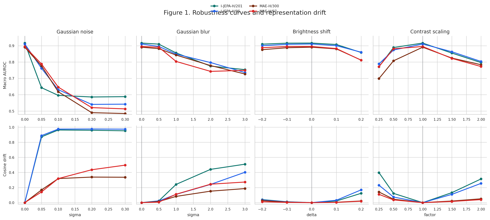
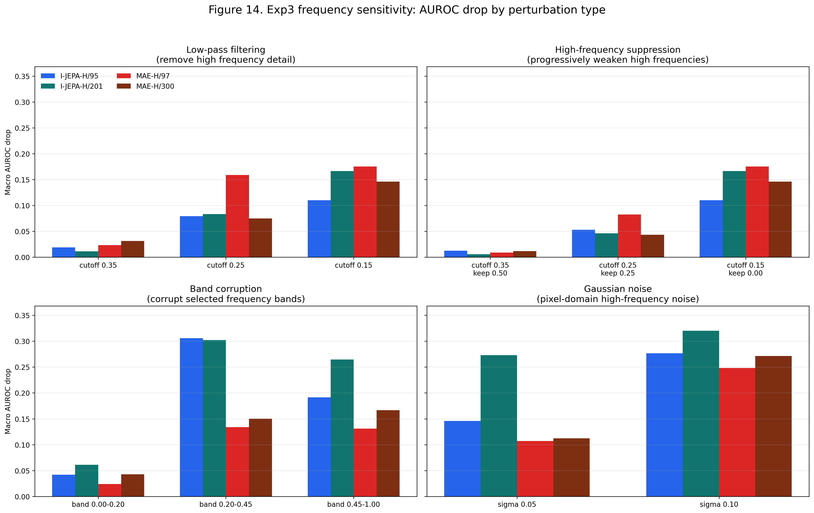
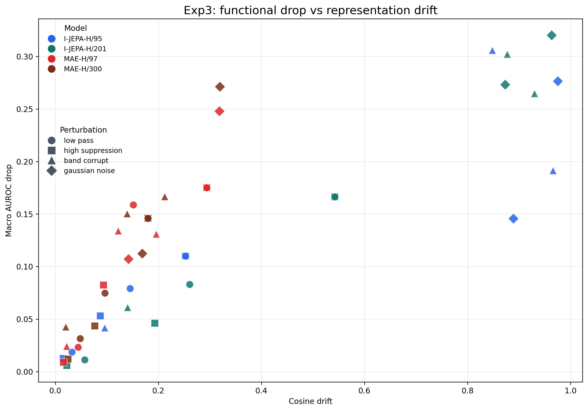
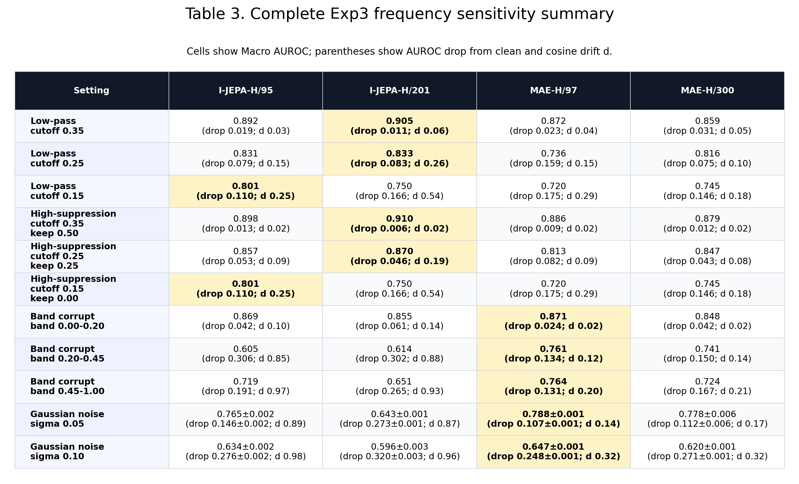

# 医学胸片自监督表征的噪声鲁棒性、下游适配性与机制分析

更新日期：2026-05-12  
上游预训练数据：MIMIC-CXR  
下游评估数据：VinDr-CXR / VinBigData labeled chest X-ray subset  
主要评估协议：fixed held-out split，train=12,000，held-out=3,000  
图表目录：`results/paper_figures/`

## 摘要

本文比较 I-JEPA 与 MAE 两类医学胸片自监督表征。最初的问题是：I-JEPA 在 frozen linear probe 下 clean AUROC 更高，是否说明 I-JEPA 学到的医学表征整体优于 MAE？随着实验推进，结论变得更细致：

1. **I-JEPA 的 clean linear separability 更强。** 在 frozen linear probe 下，I-JEPA-H/201 clean AUROC 为 0.916，高于 MAE-H/97 的 0.895 和 MAE-H/300 的 0.891。
2. **I-JEPA 对 Gaussian noise 和中高频扰动更敏感。** I-JEPA-H/201 在 Gaussian noise sigma=0.05 下 AUROC drop 约 0.273，cosine drift 约 0.87；MAE-H/97 drop 约 0.107，drift 约 0.14。
3. **Linear probe 低估了 MAE。** 新增 MLP probe 和 partial fine-tuning 后，MAE-H/97 clean AUROC 提升到 0.928 和 0.950，说明 MAE 表征并非没有诊断信息，而是部分信息不够线性可分。
4. **更强的下游头不自动带来噪声鲁棒性。** I-JEPA-H/201 使用 MLP 或 partial fine-tuning 后 clean AUROC 上升，但 Gaussian noise 下仍然严重退化，说明问题不只是 linear head 太弱，而是 encoder-level noise sensitivity。
5. **NCA 提供了一个可行的轻量改进方向。** Noise-Consistent Adapter 冻结 encoder，通过 clean/noisy 一致性适配改善噪声条件下的任务表现，但仍存在 clean-robustness tradeoff。

因此，本文的核心主张不是“谁绝对更好”，而是：

> 医学影像 SSL 表征不能只用 clean linear probe 评价。I-JEPA 更线性可分，但噪声敏感；MAE 更稳定且更可适配，但需要更强下游头或轻量微调才能释放性能。可靠的胸片 SSL 应同时考虑 clean diagnosis、noise robustness、frequency sensitivity 和 downstream adaptability。

## 1. 研究背景

胸片诊断证据通常具有三个特点：

1. **低对比度。** 很多异常只表现为轻微密度变化、边缘变化或纹理改变。
2. **局部与全局并存。** 结节、钙化等更局部；心影增大、胸腔积液、间质性改变等更依赖全局结构。
3. **成像条件不稳定。** 噪声、曝光、设备差异、压缩和后处理都会改变像素分布，但不应改变疾病语义。

因此，一个医学影像自监督 encoder 不应只在 clean 图像上分类效果好，还应满足：

- 对不应改变诊断语义的扰动保持稳定；
- 对医生标注的病灶区域有合理敏感性；
- 在更强下游适配下仍具有可利用的诊断信息；
- 不依赖单一评估协议得出过度结论。

本项目围绕这些问题建立实验链条。早期 Exp1/Exp2 主要比较 clean classification、扰动鲁棒性和病灶遮挡。后续 Exp3/Exp4 进一步做频率与 token/saliency 机制分析。Exp5/Exp6 尝试缓解噪声脆弱性。最新补充的 Exp7/Exp8 则专门回答一个关键质疑：**MAE 是否被 linear probe 低估？**

## 2. 模型与数据

### 2.1 预训练模型

| 模型 | 说明 |
|---|---|
| I-JEPA-H/95 | ViT-Huge I-JEPA，在 MIMIC-CXR 上预训练 95 epoch |
| I-JEPA-H/201 | ViT-Huge I-JEPA，当前最新可用 I-JEPA checkpoint |
| MAE-H/97 | ViT-Huge MAE，ImageNet 初始化后在 MIMIC-CXR 上预训练 97 epoch |
| MAE-H/300 | ViT-Huge MAE，继续预训练到 300 epoch |

MAE-H/300 使用 checkpoint：

`/home/jchwang/ray/outputs/mae_huge_mimic_300ep_imagenet_init_256_bs32/checkpoint-299.pth`

I-JEPA 当前使用 ep95 和 ep201。I-JEPA-H/300 尚无完整可用 checkpoint，因此不纳入当前主结果。

### 2.2 下游数据与 split

下游使用 VinDr-CXR / VinBigData labeled subset。当前本地数据没有官方 test label benchmark，因此使用 deterministic fixed held-out split：

- train：12,000 张；
- held-out：3,000 张；
- 所有模型使用同一 split、同一 label set、同一图像预处理。

这保证了模型间比较公平，但也意味着：

> 当前结果是 internal validation evidence，不是官方 test benchmark。论文和答辩中不能把它表述为官方排行榜结果。

### 2.3 标签类别

下游分类任务是 15 类多标签胸片分类：

| 类别 |
|---|
| Aortic enlargement |
| Atelectasis |
| Calcification |
| Cardiomegaly |
| Consolidation |
| ILD |
| Infiltration |
| Lung Opacity |
| Nodule/Mass |
| Other lesion |
| Pleural effusion |
| Pleural thickening |
| Pneumothorax |
| Pulmonary fibrosis |
| No finding |

这些分类标签不等同于 bbox 病灶区域。bbox 是医生标注的局部可见异常区域，而分类标签是整张图像的疾病标签。因此，遮挡某个 bbox 后分类变化不一定巨大，因为模型也可能利用全局上下文、其他区域、共现模式或非 bbox 证据。

## 3. 评价指标

| 指标 | 含义 |
|---|---|
| Macro AUROC | 多标签分类主指标，对每类 AUROC 求平均 |
| AUROC drop | 扰动后 AUROC 相对 clean 的下降 |
| F1 | 辅助指标，受阈值和类别不平衡影响较大 |
| Cosine drift | clean embedding 与扰动 embedding 的平均 cosine distance，越小表示表征越稳定 |
| L2 drift | clean embedding 与扰动 embedding 的欧氏距离 |
| Logit drop | `logit(original) - logit(occluded)`，遮挡后目标类别 logit 下降则为正 |
| Delta | lesion logit drop 减去 matched-control logit drop |

需要强调：cosine drift 和 AUROC drop 衡量不同东西。cosine drift 衡量 encoder 表征是否变；AUROC drop 衡量分类任务性能是否变。一个 encoder 可能 drift 很大但 probe 仍能部分分类，也可能 drift 不大但分类边界受影响。因此二者应同时报告，不能互相替代。

## 4. 实验总览

| 实验 | 目的 | 核心问题 |
|---|---|---|
| Exp1 | 常规扰动鲁棒性 | clean AUROC 高是否代表噪声下也稳定？ |
| Exp2b | 类别对齐病灶遮挡 | 模型是否对对应疾病 bbox 有额外敏感性？ |
| Exp3 | 频率敏感性 | Gaussian noise 脆弱性是否与中高频信息有关？ |
| Exp4 | token drift 与 saliency alignment | 表征漂移和分类证据是否落在病灶附近？ |
| Exp5 | 轻量缓解 | denoise / robust probe 是否能缓解噪声问题？ |
| Exp6 | Noise-Consistent Adapter | clean/noisy 一致性适配是否有效？ |
| Exp7 | MLP probe | MAE 是否被 linear probe 低估？ |
| Exp8 | Partial fine-tuning | 更强下游适配是否改变 MAE/I-JEPA 判断？ |

本文最终主线主要依赖 Exp1、Exp3、Exp5、Exp6、Exp7、Exp8。Exp2b/Exp4 提供病灶区域与机制分析，但不是噪声主线的核心证据。

## 5. Exp1：常规扰动鲁棒性

Exp1 使用 frozen encoder + linear probe。训练 linear probe 后，对 held-out 图像加入四类扰动：

- Gaussian noise；
- Gaussian blur；
- brightness shift；
- contrast scaling。

### 5.1 Clean linear-probe 结果

| 模型 | Clean Macro AUROC |
|---|---:|
| I-JEPA-H/201 | **0.916** |
| I-JEPA-H/95 | 0.910 |
| MAE-H/97 | 0.895 |
| MAE-H/300 | 0.891 |

在 linear probe 下，I-JEPA 的 clean 分类最强。这说明 I-JEPA 学到的诊断信息更容易被线性分类头利用。

### 5.2 Gaussian noise 结果

| 模型 | Noise 0.05 AUROC | Drop | Cosine drift |
|---|---:|---:|---:|
| I-JEPA-H/201 | 0.643 | 0.273 | 0.872 |
| I-JEPA-H/95 | 0.762 | 0.149 | 0.889 |
| MAE-H/97 | 0.788 | 0.107 | 0.142 |
| MAE-H/300 | 0.776 | 0.114 | 0.169 |

这个结果非常关键。I-JEPA-H/201 clean AUROC 最高，但轻噪声下下降最大。MAE-H/97 clean AUROC 较低，但轻噪声下反而最好，且 drift 远小于 I-JEPA。

因此 Exp1 的第一层结论是：

> I-JEPA 的 frozen linear-probe 表征更适合 clean 分类，但 MAE 的 frozen 表征对 Gaussian noise 更稳定。

## 6. Exp3：频率敏感性分析

Exp3 的目的，是解释为什么 I-JEPA 对 Gaussian noise 脆弱。实验将图像转到频域后做不同扰动：

| 扰动 | 含义 |
|---|---|
| Low-pass | 只保留低频结构，去掉高频细节，使图像变平滑 |
| High-frequency suppression | 对高频成分按比例削弱 |
| Band corruption | 只破坏某个频段，例如低频、中频或高频 |
| Gaussian noise | 像素空间随机噪声，对照条件 |

Table 3 中 Gaussian noise 行使用 5 个随机 seed 的 `mean±std`，避免单次随机噪声造成表面不一致。Table 1 与 Table 3 的 Gaussian 数值可能小幅不同，因为它们不是同一份随机噪声样本，但结论方向一致。

### 6.1 频率实验解释

在胸片中，低频通常对应大尺度亮暗结构和整体解剖布局；高频通常对应边缘、纹理、细小结构和噪声。中频则常常包含肺纹理、病灶边缘和局部密度变化。

如果模型在中高频 band corruption 下严重退化，说明它依赖的诊断证据与细粒度纹理/边缘模式有关。如果这种依赖没有被噪声不变性约束保护，Gaussian noise 就可能造成很大 representation drift。

### 6.2 关键结果

I-JEPA-H/201 在 Gaussian noise sigma=0.05 下：

- AUROC 约 0.643；
- drop 约 0.273；
- drift 约 0.87。

MAE-H/300 在同一条件下：

- AUROC 约 0.778；
- drop 约 0.112；
- drift 约 0.17。

这说明 I-JEPA 虽然不是像素级重建方法，但“预测高层 embedding”并不等于自动获得噪声不变性。它仍可能学到对胸片细粒度纹理、边缘和局部密度变化高度敏感的表征。

## 7. Exp2b：类别对齐病灶遮挡

Exp2b 用于回答：模型是否对医生标注的、与目标类别对应的病灶区域敏感。

旧版 Exp2 一次性遮挡所有 bbox，再看整体 AUROC。这有明显问题：遮挡 A 类病灶后，评估可能看的是 B 类预测，结论容易被稀释。

新版 Exp2b 的单位是 `(image_id, class_name)`：

- 只纳入该类别为阳性且存在同类 bbox 的样本；
- 只遮挡该类别 bbox；
- 同类多个 bbox 先合并成 lesion mask；
- 每个 lesion mask 生成 5 个 matched control masks；
- control 不允许覆盖任何已有 bbox；
- control 面积使用合并后 mask 的实际面积，避免重叠 bbox 面积重复相加。

### 7.1 结果解释

I-JEPA 的 lesion logit drop 和 delta 更容易解释：遮挡医生标注区域后，对应类别 logit 下降，且下降大于 matched control。

MAE 的结果更复杂。MAE 的 lesion drop 和 control drop 可能同时为负，即遮挡后目标 logit 反而升高。此时正 delta 只能说明 lesion 与 control 的相对效应不同，不能直接说明 MAE “看病灶”。

这也是为什么本文不把 Exp2b 作为最强主结论，而把它作为病灶区域敏感性的辅助证据。更稳妥的表述是：

> I-JEPA 在类别对齐遮挡中表现出更清楚的 bbox-sensitive response；MAE 的遮挡响应更难解释，可能受遮挡 artifact、上下文和分类头行为影响。

## 8. Exp4：Token Drift 与 Saliency Alignment

Exp4 进一步分析模型在图像哪里发生变化、分类证据是否和 bbox 对齐。

主要分析包括：

- clean vs noise 的 token-wise drift；
- clean vs lesion occlusion 的 token-wise drift；
- target-class saliency 与 bbox 的 overlap；
- inside-bbox saliency ratio、pointing-game hit rate、soft IoU。

Exp4 的作用是给 Exp2b 降温：即使遮挡实验显示某些类别对 bbox 敏感，也不能直接声称模型具有可靠 localization 能力。当前 saliency-bbox overlap 仍然有限，说明模型可能使用了病灶相关区域、全局结构和上下文的混合证据。

因此报告中应避免写：

> 模型准确定位了病灶。

更合理的写法是：

> 模型对病灶相关区域具有统计敏感性，但这种敏感性尚不足以等同于临床定位能力。

## 9. Exp5：轻量鲁棒性缓解

Exp5 是发现噪声脆弱性后的第一步补救实验。

它包含两类方法：

1. **Denoise preprocessing**：测试时对 noisy image 做 Gaussian smoothing 或 median filter；
2. **Robust probe training**：冻结 encoder，训练 probe 时加入 Gaussian noise、brightness 和 contrast 增强。

Exp5 回答的是：噪声问题能不能通过非常低成本的输入预处理或 probe 训练缓解？

结果显示，简单方法可以改善部分条件，但不足以解决 I-JEPA 的 encoder-level drift。尤其当 encoder 输出本身在噪声下发生大幅方向变化时，只调整线性头很难完全恢复。

## 10. Exp6：Noise-Consistent Adapter

Exp6 提出 Noise-Consistent Adapter (NCA)。它冻结 encoder，只训练一个 residual adapter + classifier。训练时，同一张图的 clean embedding 和 noisy/augmented embedding 同时进入 adapter，并加入一致性约束：

- clean BCE；
- augmented BCE；
- prediction consistency；
- representation consistency。

NCA 的价值在于：它不要求重新预训练 encoder，而是在下游任务空间中学习 clean/noisy 对齐。结果显示，NCA 能显著改善部分 noisy 条件，说明噪声脆弱性有可修复空间。

但 NCA 也有 tradeoff：它可能牺牲部分 clean AUROC，尤其对 I-JEPA 来说更明显。因此不能把 NCA 写成无代价全面提升，而应写成：

> NCA 是一个有效的鲁棒性适配方向，但仍需要优化 clean-robustness tradeoff。

## 11. Exp7：MLP Probe 评估

Exp7 是最新补充实验，目的是回答：

> MAE 是否只是被 linear probe 低估？

实验设置：

- encoder 冻结；
- 提取同一 fixed split 的 embeddings；
- 训练 2-layer MLP probe：`Linear -> GELU -> Dropout -> Linear`；
- 评估 clean 与 Gaussian noise sigma=0.05/0.10/0.20/0.30。

### 11.1 Clean 结果

| 模型 | Linear | MLP |
|---|---:|---:|
| I-JEPA-H/95 | 0.910 | 0.924 |
| I-JEPA-H/201 | 0.916 | 0.928 |
| MAE-H/97 | 0.895 | 0.928 |
| MAE-H/300 | 0.891 | 0.925 |

MLP probe 后，MAE-H/97 从 0.895 提升到 0.928，几乎与 I-JEPA-H/201 持平。这是一个很重要的发现：

> MAE 表征并不是没有诊断信息，而是相当一部分信息不够线性可分。

### 11.2 噪声结果

MLP probe 提升 clean AUROC，但不一定提升噪声鲁棒性。例如 I-JEPA-H/201：

| 方法 | Clean | Noise 0.05 | Drop |
|---|---:|---:|---:|
| Linear | 0.916 | 0.643 | 0.273 |
| MLP | 0.928 | 0.470 | 0.458 |

MLP 让 clean 更高，但 light noise 下更差。这说明更强分类头可能更充分利用 clean 图像中的敏感特征，反而放大噪声脆弱性。

MAE-H/97 则更有利：

| 方法 | Clean | Noise 0.05 | Drop |
|---|---:|---:|---:|
| Linear | 0.895 | 0.788 | 0.107 |
| MLP | 0.928 | 0.838 | 0.090 |

MAE-H/97 使用 MLP 后 clean 和轻噪声表现都提升，说明 MAE 的非线性可适配性更强。

## 12. Exp8：Partial Fine-Tuning 评估

Exp8 进一步检验：如果不只训练 probe，而是解冻 encoder 最后 2 个 ViT blocks 和分类头，结论会不会改变？

实验设置：

- 解冻最后 2 个 transformer blocks；
- 解冻 final norm；
- 训练分类 head；
- 其余 encoder 参数冻结；
- clean-only partial fine-tuning；
- 评估 clean 与 Gaussian noise。

### 12.1 Clean 结果

| 模型 | Linear | MLP | Partial FT |
|---|---:|---:|---:|
| I-JEPA-H/95 | 0.910 | 0.924 | 0.931 |
| I-JEPA-H/201 | 0.916 | 0.928 | 0.937 |
| MAE-H/97 | 0.895 | 0.928 | **0.950** |
| MAE-H/300 | 0.891 | 0.925 | **0.949** |

这是目前最重要的新结果。Partial fine-tuning 后，MAE-H/97 和 MAE-H/300 反而超过 I-JEPA-H/201。

因此，原来基于 linear probe 的结论必须修改：

旧说法：

> I-JEPA 表征比 MAE 更好。

新说法：

> I-JEPA 的 frozen linear separability 更强；MAE 的 downstream adaptability 更强，在 MLP probe 和 partial fine-tuning 下可以追上甚至超过 I-JEPA。

### 12.2 Noise 结果

| 模型与方法 | Clean | Noise 0.05 | Noise 0.10 |
|---|---:|---:|---:|
| I-JEPA-H/201 Linear | 0.916 | 0.643 | 0.596 |
| I-JEPA-H/201 Partial FT | 0.937 | 0.600 | 0.555 |
| MAE-H/97 Linear | 0.895 | 0.788 | 0.647 |
| MAE-H/97 Partial FT | 0.950 | **0.881** | **0.698** |
| MAE-H/300 Linear | 0.891 | 0.776 | 0.618 |
| MAE-H/300 Partial FT | 0.949 | 0.820 | 0.588 |

MAE-H/97 是当前最有意思的模型：partial fine-tuning 后 clean AUROC 最高，同时 light noise 下也最好。

I-JEPA-H/201 则显示出另一个现象：partial fine-tuning 提高 clean AUROC，但没有修复 noise drop。它的 noise 0.05 从 linear 的 0.643 变成 partial FT 的 0.600，反而更低。

这支持一个重要机制判断：

> I-JEPA 的 Gaussian noise 问题不是简单的分类头太弱，而是 encoder 表征本身对噪声和中高频扰动敏感。更强下游适配可以提高 clean，但不自动带来鲁棒性。

## 13. 总体讨论

### 13.1 现在最清晰的结论是什么？

第一，I-JEPA 在 frozen linear probe 下确实更强。这说明 I-JEPA 预训练得到的诊断语义更容易被线性头读出。

第二，MAE 在 linear probe 下被低估。MLP probe 和 partial fine-tuning 证明，MAE 表征中存在可利用的诊断信息，只是这些信息需要非线性头或轻量微调才能释放。

第三，MAE 对 Gaussian noise 的表征稳定性更好。尤其在 linear/frozen setting 下，MAE 的 cosine drift 远小于 I-JEPA。

第四，更强下游适配不等于更鲁棒。I-JEPA 在 MLP/partial FT 下 clean 更好，但 noise drop 仍然大，甚至某些条件更差。

第五，NCA 说明噪声问题可以通过显式一致性适配缓解，但仍需要处理 clean-robustness tradeoff。

### 13.2 论文主线应该如何表述？

推荐主线：

> 本文发现，在医学胸片自监督表征中，clean linear separability、noise robustness 和 downstream adaptability 是三个不同维度。I-JEPA 在 frozen linear probe 下具有更强 clean 诊断可分性，但对 Gaussian noise 和中高频扰动高度敏感。MAE 在 linear probe 下看似较弱，但经过 MLP probe 和 partial fine-tuning 后可追上甚至超过 I-JEPA，并且在轻噪声下表现更稳。因此，医学影像 SSL 不能只报告 clean linear probe；应同时评价噪声鲁棒性、频率敏感性和下游适配能力。

### 13.3 这对方法改进有什么启发？

当前结果指向两个方向：

1. **Robust partial fine-tuning**
   - 当前 Exp8 是 clean-only partial FT；
   - 下一步应加入 Gaussian noise augmentation 或 NCA-style consistency；
   - 目标是同时保持 MAE/I-JEPA 的高 clean AUROC 和低 noise drop。

2. **Frequency-aware SSL / adaptation**
   - Exp3 显示中高频扰动是关键；
   - 后续可以在 adapter 或 pretraining objective 中加入 frequency corruption consistency；
   - 目标是让模型保留医学细节，但不要被随机高频噪声破坏。

## 14. 答辩时可以怎么讲

可以用下面这段话作为核心回答：

> 我们最初看到 I-JEPA 在 linear probe 下 clean AUROC 更高，但进一步实验发现这不是完整故事。I-JEPA 的表征更线性可分，但对 Gaussian noise 和中高频扰动非常敏感。MAE 在 linear probe 下被低估，换成 MLP probe 或 partial fine-tuning 后可以追上甚至超过 I-JEPA，尤其 MAE-H/97 在轻噪声下表现更稳。因此，这项工作的核心不是证明某个 SSL 方法绝对更好，而是指出医学影像表征评价必须同时看 clean performance、噪声鲁棒性和下游可适配性。后续改进方向是 noise-consistent 或 frequency-aware adaptation，让模型既能利用医学细节，又不过度受噪声影响。

## 15. 当前限制

1. 当前结果基于 fixed held-out split，不是官方 test benchmark。
2. Gaussian noise 是人工扰动，不能完全代表真实临床域偏移。
3. Exp8 是 clean-only partial fine-tuning，不是 robust fine-tuning。
4. MLP probe 和 partial fine-tuning 超参数没有大规模搜索，结果更适合机制分析，不应被包装成最优下游性能。
5. bbox occlusion 和 saliency alignment 不能等同于临床 localization。
6. NCA 仍然是下游适配方法，不能说明 encoder 本身已经变鲁棒。

## 16. 最终结论

当前最稳妥、最有论文价值的结论是：

1. I-JEPA-H 的 clean frozen linear-probe 表现更强。
2. I-JEPA-H 对 Gaussian noise 和中高频扰动明显更敏感。
3. MAE-H 的 frozen 表征 drift 更小，噪声下更稳定。
4. MAE-H 在 linear probe 下被低估；MLP probe 和 partial fine-tuning 后，MAE-H/97 与 MAE-H/300 可追上甚至超过 I-JEPA-H/201。
5. 更强下游适配不能自动解决 I-JEPA 的噪声问题，说明它更像 encoder-level sensitivity。
6. NCA 和未来的 robust partial fine-tuning / frequency-aware adaptation 是合理的改进方向。

这使本文从简单 baseline 比较升级为一个更完整的问题：

> 医学影像 SSL 的目标不应只是提高 clean AUROC，而应在语义可分性、噪声稳定性和下游适配性之间取得平衡。
