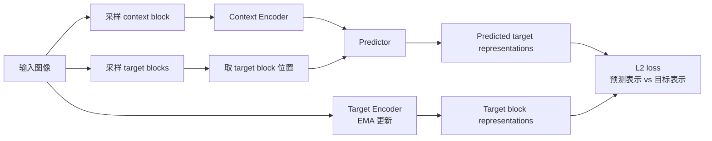
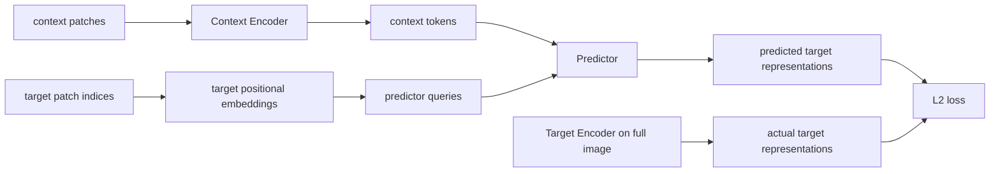
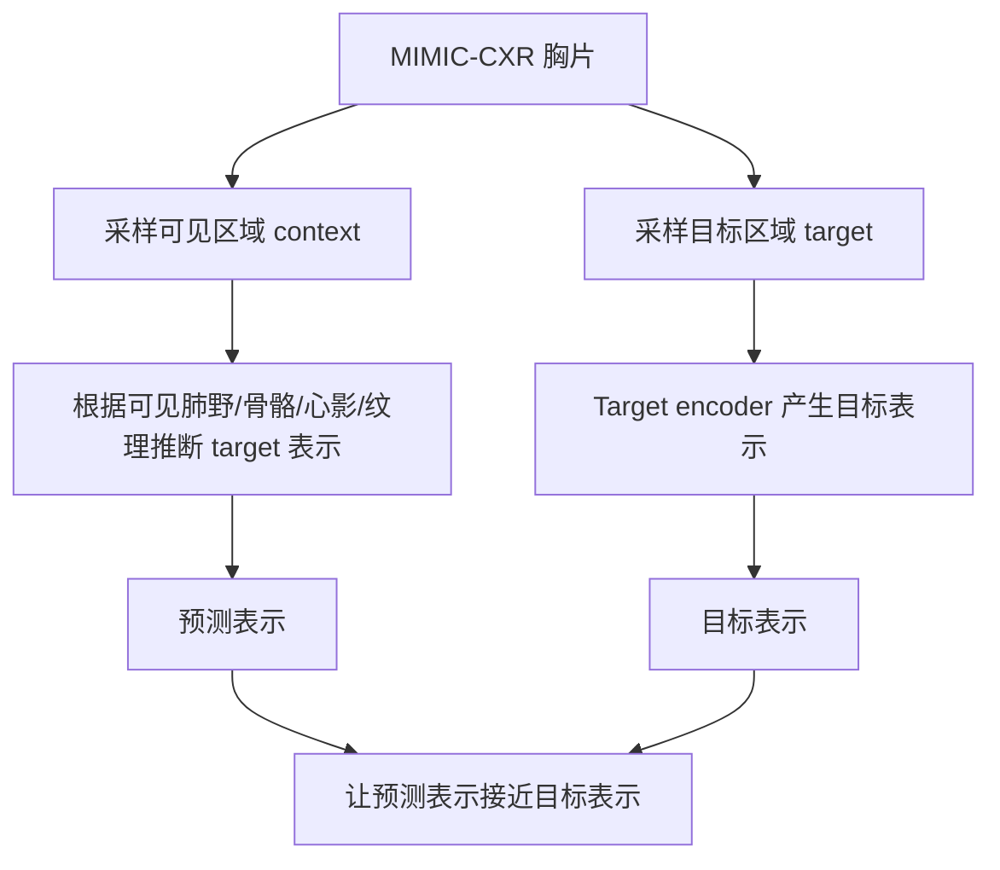
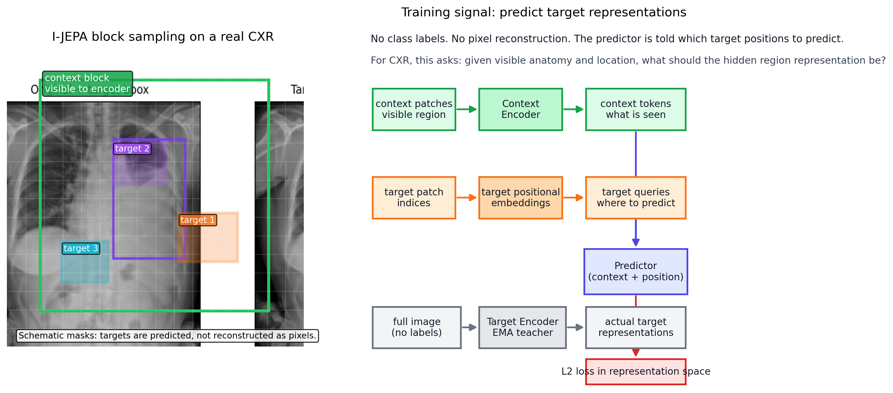

# I-JEPA 原理与医学胸片预训练解释

更新日期：2026-05-10

## 1. 先抓住一句话

**I-JEPA 预训练阶段不涉及分类，也不知道疾病标签。**

它的核心任务不是“判断这张图有没有病”，而是：

> 给定图像中可见的上下文区域，预测被遮挡目标区域的高层表征。

这里的“预测”不是预测像素颜色，而是预测一个由神经网络编码出来的 latent representation。也就是说，I-JEPA 学的是图像内部不同区域之间的结构关系。

## 2. JEPA 想解决什么问题？

自监督学习的目标是：不用人工标签，让模型自己从数据中学表示。

常见方法有三类：

| 方法 | 学习方式 | 例子 | 主要问题 |
|---|---|---|---|
| 对比/不变性学习 | 让同一图像的不同增强视图表示接近 | SimCLR, DINO 一类方法 | 需要设计增强；增强定义了哪些变化应该被忽略 |
| 生成式重建 | 遮住一部分输入，然后重建像素或 token | MAE | 可能花很多能力重建低层细节 |
| JEPA | 从一部分输入的表示，预测另一部分输入的表示 | I-JEPA | 预测 latent representation，不直接重建像素 |

I-JEPA 的核心思想是：

> 不预测像素，预测表示。

它认为很多像素级细节是不必要的。例如一只狗的头被遮住时，人不需要知道每根毛的具体像素，也能预测那里大概是“狗头”。I-JEPA 希望模型学习这种更抽象、更语义的预测能力。

## 3. I-JEPA 的训练流程

I-JEPA 一张图像内会采样两类区域：

- **context block**：模型能看到的上下文区域。
- **target blocks**：模型需要预测的目标区域。

训练时有三个模块：

- **context encoder**：只看 context patches。
- **target encoder**：看完整图像，产生 target blocks 的目标表示。
- **predictor**：根据 context encoder 的输出和 target 位置信息，预测 target blocks 的表示。

目标 encoder 不直接用梯度训练，而是用 context encoder 的指数滑动平均更新。



### 重要点

1. **没有疾病标签。**
2. **没有分类头参与预训练。**
3. **没有重建像素。**
4. **loss 在 embedding space 里算。**
5. **target block 通常比较大，目的是让预测更偏语义。**

原论文的说法是：I-JEPA 从一个 context block 预测同一图像中多个 target blocks 的表示；它是非生成式方法，预测发生在 representation space，而不是 pixel/token space。

## 4. context block 和 target block 是怎么选的？

这里先统一术语：原论文里通常叫 **context block**，不是 content block。

- **context block**：模型能看到的区域。
- **target block**：模型需要预测的区域。

I-JEPA 会先把图像切成 ViT patches。比如输入是 224×224，patch size 是 14，那么图像会变成：

```text
----+----+----+----+----+
| p1 | p2 | p3 | .. |    |
+----+----+----+----+----+
|    |    |    |    |    |
+----+----+----+----+----+
|    |    |    |    |    |
+----+----+----+----+----+
```

实际是 16×16 个 patch，共 256 个 patch tokens。

### 4.1 target block 的选择

target block 通常是连续的矩形区域，而不是零散小点。训练时会在同一张图上随机采样多个 target blocks。

可以想象成：

```text
胸片 patch grid
+--------------------------+
|                          |
|      [ target 1 ]        |
|                          |
|              [ target 2 ]|
|                          |
| [ target 3 ]             |
|                          |
+--------------------------+
```

target block 通常比较大。这样做的目的，是避免模型只靠相邻像素做低级补全，而是逼它利用更大的上下文结构。

### 4.2 context block 的选择

context block 也是一个较大的连续区域，代表模型实际能看到的部分。

训练时，context encoder 只编码 context patches；target patches 不允许直接进入 context encoder。否则模型就不是预测，而是抄答案。

简化理解如下：

```text
+--------------------------+
|                          |
|   context visible area   |
|   +------------------+   |
|   |                  |   |
|   |    [target]      |   |
|   |                  |   |
|   +------------------+   |
|                          |
+--------------------------+
```

真实实现中，context block 和 target block 的采样会有尺度、长宽比和位置的随机性。关键不是某一个固定形状，而是：

> 给模型一部分区域，让它预测另一些区域的表示。

## 5. predictor 是怎么知道 target 位置的？

这是理解 I-JEPA 的关键。

I-JEPA 不是只把 context embedding 给 predictor，然后让它盲猜。predictor 还会拿到 **target 位置对应的 positional embeddings**。

也就是说，predictor 的输入包含两类信息：

```text
context tokens + target position tokens
```

通俗地说：

> predictor 不只是知道“我看到了哪些 context”，还知道“我要预测图像里的哪个位置”。

### 5.1 为什么必须告诉它位置？

同一张胸片里，不同位置的含义完全不同：

- 上肺野；
- 心影旁边；
- 肋膈角；
- 膈肌下方；
- 左肺外侧；
- 右下肺野。

如果只给 context，不告诉 target 在哪里，模型不知道你要预测的是哪个区域。

所以需要 target positional embedding。

### 5.2 位置是怎么加进去的？

ViT 里每个 patch 位置都有一个 positional embedding。假设图像被切成 16×16 个 patch：

```text
(0,0), (0,1), ..., (0,15)
(1,0), (1,1), ..., (1,15)
...
(15,0), ...,      (15,15)
```

如果 target block 覆盖右下肺野几个 patch，比如：

```text
(11,10), (11,11), (11,12)
(12,10), (12,11), (12,12)
```

那么 predictor 会拿这些位置的 positional embeddings，作为 target query。

更接近数学形式：

```text
z_context = ContextEncoder(context_patches)

q_target = positional_embedding(target_patch_indices)

pred_target = Predictor(z_context, q_target)

target_repr = TargetEncoder(full_image)[target_patch_indices]

loss = distance(pred_target, target_repr)
```

其中：

- `z_context` 是模型看到的内容；
- `q_target` 是要预测的位置；
- `pred_target` 是 predictor 预测出来的 target 表示；
- `target_repr` 是 target encoder 给出的目标表示；
- loss 让二者接近。

流程图如下：



### 5.3 胸片里的直观例子

假设 target 在右下肺野：

```text
+--------------------------+
|        upper lung        |
|                          |
| left lung       right    |
|                 lower    |
|                 [target] |
| diaphragm                |
+--------------------------+
```

target positional embedding 告诉 predictor：

> 我要你预测的是右下肺这个位置，不是左上肺，也不是心影。

context tokens 提供：

> 周围肺纹理、肋骨走向、膈肌位置、心影边界、左右肺结构。

predictor 综合两者，预测右下肺区域的 latent representation。

所以 I-JEPA 学到的是：

> 给定上下文和空间位置，一个区域在这张图里应该具有怎样的高层表示。

## 6. 和 MAE 的区别

MAE 的逻辑更像：


MAE 直接问：

> 被遮住的像素是什么？

I-JEPA 问：

> 被遮住区域的高层表示应该是什么？

这导致一个关键差异：

| 对比项 | MAE | I-JEPA |
|---|---|---|
| 预测目标 | 像素/token | target encoder 的 latent representation |
| 是否生成图像 | 是，重建像素 | 否，不重建像素 |
| 目标倾向 | 保留可重建细节 | 学可预测的抽象结构 |
| 下游使用 | encoder 表征 | context encoder 表征 |

## 7. 医学胸片上 I-JEPA 是怎么预训练的？

你的项目里，I-JEPA 的上游数据是 MIMIC-CXR。预训练时它并不知道：

- 这张片有没有肺炎；
- 有没有胸腔积液；
- bbox 在哪里；
- 分类标签是什么。

它只看到大量胸片，然后做自监督预测：



在胸片里，模型可能学到这些可预测结构：

- 左右肺的大体对称性；
- 肋骨、锁骨、心影、膈肌的位置关系；
- 肺野纹理和密度分布；
- 不同解剖区域的灰度模式；
- 某些异常导致的局部密度变化或边缘变化。

注意：这些不是通过标签告诉它的，而是因为它们在大量胸片中反复出现，并且有助于从上下文预测目标区域表示。

### 7.1 I-JEPA 预训练图例：真实胸片上的 context 与 target

下面这张图才是和 I-JEPA 预训练直接对应的示意图。左边用一张真实胸片作为底图，叠加了 patch grid、context block 和 target blocks；右边画的是训练信号。



这张图应该这样读：

1. 真实胸片先被切成 ViT patches。
2. 绿色框表示 context block，也就是 context encoder 能看到的区域。
3. 彩色小框表示 target blocks，也就是 predictor 要预测的区域。
4. target blocks 的像素不是训练目标；训练目标是 target encoder 产生的 latent representations。
5. predictor 同时拿到两类信息：
   - context encoder 输出的 context tokens，代表“看到了什么”；
   - target positional embeddings，代表“要预测哪里”。
6. loss 比较的是 predicted target representations 和 actual target representations，而不是像素重建误差。

所以，在胸片预训练里，I-JEPA 做的事情可以通俗理解为：

> 给定胸片里可见的解剖结构和要预测的位置，模型学习预测该位置应该具有怎样的高层表示。

这张图描述的是 I-JEPA 在 MIMIC-CXR 上自监督预训练时的任务形式：从可见胸片区域预测目标胸片区域的表示。

## 参考资料

- Assran et al., *Self-Supervised Learning from Images with a Joint-Embedding Predictive Architecture*, CVPR 2023 / arXiv: https://arxiv.org/abs/2301.08243
- CVF open-access paper PDF: https://openaccess.thecvf.com/content/CVPR2023/papers/Assran_Self-Supervised_Learning_From_Images_With_a_Joint-Embedding_Predictive_Architecture_CVPR_2023_paper.pdf
- Official I-JEPA GitHub: https://github.com/facebookresearch/ijepa
- Meta AI blog: https://ai.meta.com/blog/yann-lecun-ai-model-i-jepa/
