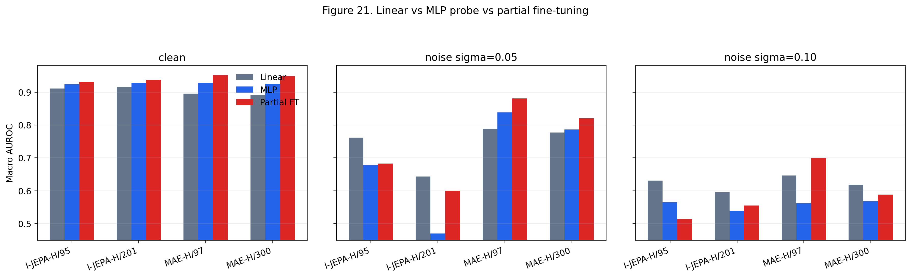
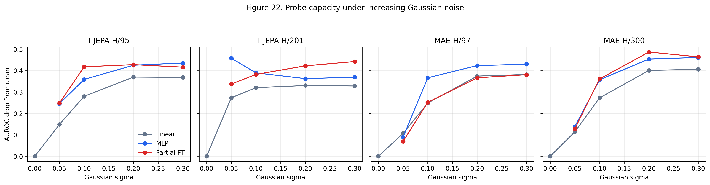
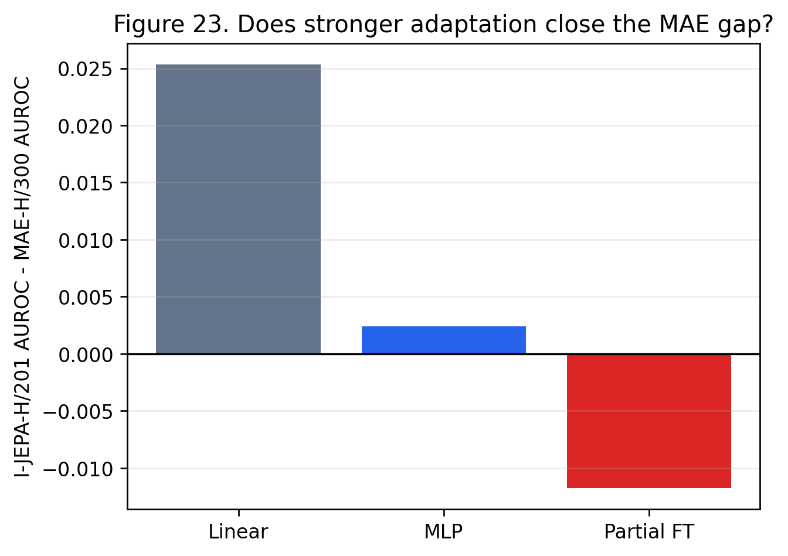
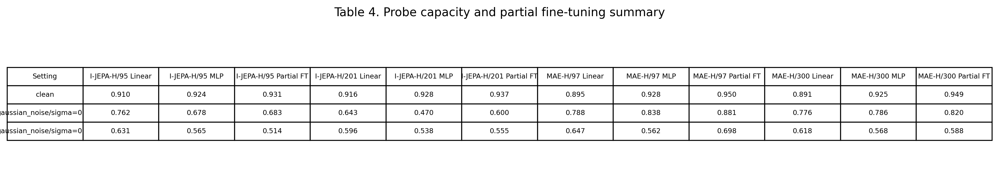

# Noise Robustness Report

## 1. 核心问题

这份报告只讨论一条主线：**医学影像自监督表征在 clean 图像上表现好，并不等于在 Gaussian noise 下可靠。**

我们现在比较的是四个 encoder：

| Model | 说明 |
|---|---|
| I-JEPA-H/95 | I-JEPA huge，较早 checkpoint |
| I-JEPA-H/201 | I-JEPA huge，当前主要 I-JEPA baseline |
| MAE-H/97 | MAE huge，较短 MIMIC-CXR 预训练 |
| MAE-H/300 | MAE huge，较长 MIMIC-CXR 预训练 |

当前数据使用 VinBigData/VinDr-CXR 的 fixed held-out split：train 12,000 张，held-out 3,000 张。这个 split 用于论文内部比较，但仍不是官方 test benchmark。

## 2. 为什么只看 Linear Probe 不够

最初的主要结果来自 frozen encoder + linear probe。这个设置很干净：encoder 完全冻结，只看表征是否容易被线性分类器利用。

但这个设置也有局限。MAE 这类重建式 SSL 可能学到很多局部结构、纹理和空间细节，这些信息未必天然线性可分。如果只用 linear probe，可能会低估 MAE 的下游可适配性。

因此我们补了两组实验：

| 实验 | 做什么 | 回答什么问题 |
|---|---|---|
| Exp7 MLP Probe | 冻结 encoder，训练 2-layer MLP probe | MAE 是否只是“不线性可分”？ |
| Exp8 Partial Fine-tuning | 解冻最后 2 个 ViT blocks + 分类头 | 更强下游适配后，MAE/I-JEPA 的差距是否改变？ |

## 3. 主要结果

关键数值如下：

| Setting | I-JEPA-H/201 Linear | I-JEPA-H/201 MLP | I-JEPA-H/201 Partial FT | MAE-H/97 Linear | MAE-H/97 MLP | MAE-H/97 Partial FT | MAE-H/300 Linear | MAE-H/300 MLP | MAE-H/300 Partial FT |
|---|---:|---:|---:|---:|---:|---:|---:|---:|---:|
| Clean | 0.916 | 0.928 | 0.937 | 0.895 | 0.928 | **0.950** | 0.891 | 0.925 | **0.949** |
| Noise 0.05 | 0.643 | 0.470 | 0.600 | 0.788 | **0.838** | **0.881** | 0.776 | 0.786 | 0.820 |
| Noise 0.10 | 0.596 | 0.538 | 0.555 | 0.647 | 0.562 | **0.698** | 0.618 | 0.568 | 0.588 |

## 4. 结论一：Linear Probe 确实低估了 MAE

Linear probe 下，I-JEPA-H/201 clean AUROC 是 0.916，高于 MAE-H/97 的 0.895 和 MAE-H/300 的 0.891。

但是换成 MLP probe 后，MAE-H/97 clean AUROC 提升到 0.928，几乎和 I-JEPA-H/201 的 0.928 持平。进一步 partial fine-tuning 后，MAE-H/97 达到 0.950，MAE-H/300 达到 0.949，反而高于 I-JEPA-H/201 的 0.937。

这说明之前不能简单写成“MAE 表征弱”。更准确的说法是：

> 在 frozen linear-probe 评价下，I-JEPA 的诊断信息更线性可分；但 MAE 表征具有较强的下游可适配性，经过非线性 probe 或轻量 partial fine-tuning 后可以追上甚至超过 I-JEPA。

这个结果对论文很重要，因为它把结论从“谁更好”改成了更细的机制判断：

- I-JEPA 的优势：clean frozen linear separability 强。
- MAE 的优势：表征可适配性强，partial fine-tuning 后 clean performance 更高。
- 因此，linear probe 只能评价“线性可分性”，不能完整评价医学 SSL 表征质量。

## 5. 结论二：MAE 对 Gaussian Noise 更稳，但不是所有适配都会提升鲁棒性

在 linear probe 下，MAE 对 Gaussian noise 明显更稳：

| Model | Noise 0.05 AUROC Drop | Noise 0.05 Cosine Drift |
|---|---:|---:|
| I-JEPA-H/201 Linear | 0.273 | 0.872 |
| MAE-H/97 Linear | 0.107 | 0.142 |
| MAE-H/300 Linear | 0.114 | 0.169 |

这说明 I-JEPA 的 encoder 输出在噪声下发生了大幅方向漂移；MAE 的 frozen embedding 更稳定。

但是 Exp7/Exp8 也显示：**更强的下游适配不一定自动提升噪声鲁棒性。**

例如 I-JEPA-H/201：

- Linear clean: 0.916
- MLP clean: 0.928
- Partial FT clean: 0.937

clean 性能逐步提高，但 Gaussian noise 0.05 下：

- Linear: 0.643
- MLP: 0.470
- Partial FT: 0.600

也就是说，更强 probe/微调提升了 clean 分类，但并没有解决 I-JEPA 的噪声脆弱性。MLP 甚至可能更依赖 clean 表征中的敏感特征，导致轻噪声下掉得更厉害。

MAE-H/97 则更有利：

- Linear noise 0.05: 0.788
- MLP noise 0.05: 0.838
- Partial FT noise 0.05: 0.881

MAE-H/97 不仅 clean 变强，轻噪声下也明显改善。这支持一个新的判断：

> MAE 的诊断信息可能不是最线性可分，但在适当的非线性/局部微调后，它能同时获得较好的 clean 性能和较好的轻噪声鲁棒性。

## 6. 结论三：I-JEPA 的问题更像 Encoder-Level Noise Sensitivity

Exp1 和 Exp3 已经显示，I-JEPA 在 Gaussian noise 和中高频扰动下 cosine drift 很大。Exp7/Exp8 进一步说明，这个问题不能只归因于 linear probe 太弱。

如果问题主要是 linear head 不够强，那么 MLP probe 或 partial fine-tuning 应该显著修复 I-JEPA 的 noise drop。但结果不是这样：

| I-JEPA-H/201 | Clean AUROC | Noise 0.05 AUROC | Drop |
|---|---:|---:|---:|
| Linear | 0.916 | 0.643 | 0.273 |
| MLP | 0.928 | 0.470 | 0.458 |
| Partial FT | 0.937 | 0.600 | 0.337 |

Partial fine-tuning 提高了 clean performance，但 noise drop 仍然很大。MLP probe 更差。这说明 I-JEPA 的噪声问题至少部分来自 encoder 表征本身，而不是简单的线性分类头问题。

更通俗地说：

> I-JEPA 学到的 clean 胸片特征很有诊断价值，但这些特征中有一部分对高频噪声非常敏感。下游分类器越强，越可能利用这些敏感特征，从而在 clean 上更好、在 noise 下更脆弱。

## 7. Exp5/Exp6 在这条线里的位置

Exp5 和 Exp6 不是孤立实验，它们是在回答“发现噪声脆弱性后怎么缓解”。

Exp5 试了两个简单方案：

1. **Denoise preprocessing**：测试时先滤波，降低输入噪声。
2. **Robust probe training**：冻结 encoder，训练 probe 时加入噪声、亮度、对比度增强。

Exp6 进一步做了 **Noise-Consistent Adapter (NCA)**：

- encoder 冻结；
- 训练 residual adapter + classifier；
- 同一张图的 clean/noisy embedding 经过 adapter 后，要求预测更一致、表示更一致。

从逻辑上看：

- Exp7/Exp8 说明“更强下游适配”可以改变 MAE/I-JEPA 的 clean ranking。
- Exp5/Exp6 说明“普通适配”不够，还需要明确的 noise-aware consistency。
- NCA 的价值是把目标从“只提高 clean 分类”改成“让 clean/noisy 在任务空间更一致”。

## 8. 当前论文主线应该如何改

原来的主线容易写成：

> I-JEPA clean 更强，但对 noise 脆弱；MAE clean 弱但 drift 小。

现在应该升级为：

> I-JEPA 学到更线性可分的 clean 诊断表征，但这种表征对 Gaussian noise 和中高频扰动非常敏感。MAE 在 linear probe 下被低估；经过 MLP probe 或 partial fine-tuning 后，MAE 可以追上甚至超过 I-JEPA，尤其 MAE-H/97 在轻噪声下表现更稳。医学 SSL 的评价不应只看 frozen linear probe，而应同时考察线性可分性、非线性可适配性、partial fine-tuning 性能和噪声鲁棒性。

这条主线比之前更强，因为它回答了一个潜在审稿质疑：

> 你是不是用 linear probe 低估了 MAE？

现在答案是：

> 是的，linear probe 低估了 MAE 的下游可适配性；但这不推翻噪声结论，反而说明不同 SSL objective 在“线性可分性”和“鲁棒可适配性”上有不同权衡。

## 9. 最终可写入论文的结论

1. **Linear separability**：I-JEPA-H 在 frozen linear probe 下 clean AUROC 更高，说明它的诊断信息更容易被线性头利用。
2. **Nonlinear adaptability**：MAE-H 在 MLP probe 和 partial fine-tuning 下明显改善，说明 MAE 被 linear probe 低估。
3. **Noise robustness**：MAE 在 Gaussian noise 下的 representation drift 明显小于 I-JEPA，轻噪声条件下 MAE-H/97 的性能尤其稳定。
4. **I-JEPA limitation**：I-JEPA 的噪声问题不是简单换更强分类头就能解决；MLP/partial FT 提升 clean 后，noise drop 仍然很大。
5. **Method direction**：后续方法应结合 MAE 式稳定性和 I-JEPA 式语义表征，并显式加入 noise-consistency 或 frequency-aware pretraining/adaptation。

## 10. 下一步建议

最值得继续做的是两个方向：

1. **Robust partial fine-tuning**
   - 当前 Exp8 是 clean-only partial fine-tuning。
   - 下一步可以在 partial fine-tuning 中加入 Gaussian noise augmentation 或 NCA-style consistency。
   - 目标是看 MAE/I-JEPA 能否同时保持 high clean AUROC 和 low noise drop。

2. **Frequency-aware JEPA / MAE adaptation**
   - Exp3 显示中高频扰动是关键。
   - 可以训练 adapter 或 probe 时加入 frequency corruption，而不只是 pixel Gaussian noise。
   - 如果有效，可以形成更明确的方法贡献：frequency-aware robust adaptation for medical SSL.

## 11. 限制

1. 当前结果来自 fixed held-out split，不是官方 test benchmark。
2. Partial fine-tuning 使用 clean-only 训练，因此它不是鲁棒训练方法，只是评估表征可适配性。
3. MLP probe 和 partial fine-tuning 的超参数没有大规模搜索，结果用于机制判断，不用于声称最优性能。
4. Gaussian noise 是人工扰动，不能完全代表真实临床噪声、设备差异或域偏移。
